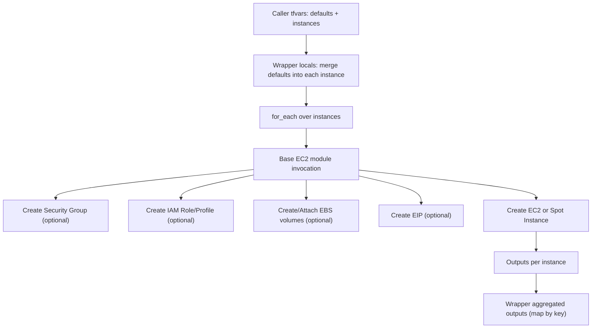

### Wrapper module for creating multiple EC2 instances using for_each

### Overview

This wrapper consumes the root EC2 module in this repository and lets you define many instances at once via a single map variable. It shallow-merges an optional defaults map into each instance, so you can avoid repeating common settings.

### Inputs

- instances (map(any))
  - Keyed by instance key, each value may include ANY of the root module inputs. Common keys include: name, region, subnet_id, instance_type, ami or ami_ssm_parameter, ignore_ami_changes, associate_public_ip_address, availability_zone, capacity_reservation_specification, cpu_options, cpu_credits, disable_api_stop, disable_api_termination, ebs_optimized, enclave_options_enabled, enable_primary_ipv6, ephemeral_block_device, get_password_data, hibernation, host_id, host_resource_group_arn, iam_instance_profile, instance_initiated_shutdown_behavior, instance_market_options, ipv6_address_count, ipv6_addresses, key_name, launch_template, maintenance_options, metadata_options, monitoring, network_interface, placement_group, placement_partition_number, private_dns_name_options, private_ip, root_block_device, secondary_private_ips, source_dest_check, tags, instance_tags, tenancy, user_data, user_data_base64, user_data_replace_on_change, volume_tags, enable_volume_tags, vpc_security_group_ids, timeouts, create_spot_instance, spot_instance_interruption_behavior, spot_launch_group, spot_price, spot_type, spot_wait_for_fulfillment, spot_valid_from, spot_valid_until, ebs_volumes, create_iam_instance_profile, iam_role_name, iam_role_use_name_prefix, iam_role_path, iam_role_description, iam_role_permissions_boundary, iam_role_policies, iam_role_tags, create_security_group, security_group_name, security_group_use_name_prefix, security_group_description, security_group_vpc_id, security_group_tags, security_group_egress_rules, security_group_ingress_rules, create_eip, eip_domain, eip_tags.

- defaults (any)
  - A map merged into every instance value (instance-specific values win). Useful for setting common region, subnet_id, tags, etc.

- putin_khuylo (bool)
  - Required flag from the root module; default true.

### Inputs table (base module compatible)

| Name | Type | Default | Description |
| --- | --- | --- | --- |
| create | bool | true | Whether to create an instance |
| name | string | "" | Name to be used on EC2 instance created |
| region | string | null | Region where the resource(s) will be managed |
| ami | string | null | ID of AMI to use for the instance |
| ami_ssm_parameter | string | "/aws/service/ami-amazon-linux-latest/al2023-ami-kernel-default-x86_64" | SSM parameter name for the AMI ID |
| ignore_ami_changes | bool | false | Ignore AMI ID changes (forces replace if toggled) |
| associate_public_ip_address | bool | null | Associate a public IP in a VPC |
| availability_zone | string | null | AZ to start the instance in |
| capacity_reservation_specification | object | null | Capacity Reservation targeting options |
| cpu_options | object | null | CPU options (core_count, threads_per_core, amd_sev_snp) |
| cpu_credits | string | null | CPU credit option for T-family |
| disable_api_termination | bool | null | Enable termination protection |
| disable_api_stop | bool | null | Enable stop protection |
| ebs_optimized | bool | null | Launch as EBS-optimized |
| enclave_options_enabled | bool | null | Enable Nitro Enclaves |
| enable_primary_ipv6 | bool | null | Assign primary IPv6 GUA in dual-stack/IPv6-only subnets |
| ephemeral_block_device | map(object) | null | Instance store volume settings |
| get_password_data | bool | null | Wait for and retrieve Windows password data |
| hibernation | bool | null | Enable instance hibernation |
| host_id | string | null | Dedicated host ID to place the instance on |
| host_resource_group_arn | string | null | Host resource group ARN (tenancy host) |
| iam_instance_profile | string | null | Existing IAM instance profile name |
| instance_initiated_shutdown_behavior | string | null | Shutdown behavior (stop/terminate) |
| instance_market_options | object | null | Market options; overrides create_spot_instance |
| instance_type | string | "t3.micro" | Instance type |
| ipv6_address_count | number | null | Number of IPv6 addresses to assign |
| ipv6_addresses | list(string) | null | Specific IPv6 addresses to assign |
| key_name | string | null | SSH key pair name |
| launch_template | object | null | Launch template (id/name/version) |
| maintenance_options | object | null | Maintenance options (auto_recovery) |
| metadata_options | object | {http_endpoint="enabled", http_put_response_hop_limit=1, http_tokens="required"} | Instance metadata service options |
| monitoring | bool | null | Enable detailed CloudWatch monitoring |
| network_interface | map(object) | null | Attach pre-existing ENIs at boot |
| placement_group | string | null | Placement group name |
| placement_partition_number | number | null | Partition number (partition strategy) |
| private_dns_name_options | object | null | Private DNS options (A/AAAA records, hostname_type) |
| private_ip | string | null | Primary private IPv4 address |
| root_block_device | object | null | Root volume configuration (size, type, iops, kms, tags) |
| secondary_private_ips | list(string) | null | Secondary private IPv4 addresses on eth0 |
| source_dest_check | bool | null | Disable for NAT/VPN use cases |
| subnet_id | string | null | Subnet ID to launch in |
| tags | map(string) | {} | Resource tags |
| instance_tags | map(string) | {} | Additional instance-only tags |
| tenancy | string | null | Tenancy: default, dedicated, or host |
| user_data | string | null | Plain-text user data script |
| user_data_base64 | string | null | Base64-encoded user data |
| user_data_replace_on_change | bool | null | Force recreate when user data changes |
| volume_tags | map(string) | {} | Tags for volumes created at launch |
| enable_volume_tags | bool | true | Enable volume tags (conflicts with root_block_device.tags) |
| vpc_security_group_ids | list(string) | [] | Security group IDs to attach |
| timeouts | map(string) | {} | Create/update/delete timeouts |
| create_spot_instance | bool | false | Create a Spot instance request |
| spot_instance_interruption_behavior | string | null | Spot interruption behavior (terminate/stop/hibernate) |
| spot_launch_group | string | null | Spot launch group |
| spot_price | string | null | Max Spot price (defaults to on-demand) |
| spot_type | string | null | Spot request type (persistent/one-time) |
| spot_wait_for_fulfillment | bool | null | Wait for fulfillment (10m timeout) |
| spot_valid_from | string | null | Spot request start time (RFC3339) |
| spot_valid_until | string | null | Spot request end time (RFC3339) |
| ebs_volumes | map(object) | null | Additional EBS volumes and attachments |
| create_iam_instance_profile | bool | false | Create IAM instance profile and role |
| iam_role_name | string | null | Name for role when creating |
| iam_role_use_name_prefix | bool | true | Use name as prefix for role |
| iam_role_path | string | null | Role path |
| iam_role_description | string | null | Role description |
| iam_role_permissions_boundary | string | null | Permissions boundary ARN |
| iam_role_policies | map(string) | {} | Inline/managed policies to attach |
| iam_role_tags | map(string) | {} | Additional tags for role/profile |
| create_security_group | bool | true | Create a security group |
| security_group_name | string | null | Security group name |
| security_group_use_name_prefix | bool | true | Use name as prefix for SG |
| security_group_description | string | null | Security group description |
| security_group_vpc_id | string | null | VPC ID for security group (default VPC if null) |
| security_group_tags | map(string) | {} | Additional tags for security group |
| security_group_egress_rules | map(object) | see default | Egress rules; defaults allow all IPv4/IPv6 |
| security_group_ingress_rules | map(object) | null | Ingress rules |
| create_eip | bool | false | Create and associate an Elastic IP |
| eip_domain | string | "vpc" | EIP domain (vpc) |
| eip_tags | map(string) | {} | Tags for EIP |
| putin_khuylo | bool | true | Required confirmation flag |

### Map-typed inputs and schemas

- instances (map(any))
  - Keyed by instance key. Each value is a map of base module inputs for that instance.

- defaults (map)
  - Shallow-merged into each instance before applying. Per-instance values override defaults.

- tags (map(string)) / instance_tags (map(string)) / volume_tags (map(string)) / security_group_tags (map(string)) / eip_tags (map(string)) / iam_role_tags (map(string))
  - Key-value tags. Values must be strings.

- iam_role_policies (map(string))
  - Map of policy_name => policy_arn to attach to the created role.

- timeouts (map(string))
  - Keys: `create`, `update`, `delete`. Values are duration strings, e.g., "30m".

- ebs_volumes (map(object))
  - Keyed by a logical volume name; value schema:
    - encrypted (bool), final_snapshot (bool), iops (number), kms_key_id (string), multi_attach_enabled (bool), outpost_arn (string), size (number), snapshot_id (string), throughput (number), type (string, default "gp3")
    - tags (map(string), default {})
    - Attachment: device_name (string, optional; defaults to map key), force_detach (bool), skip_destroy (bool), stop_instance_before_detaching (bool)

- network_interface (map(object))
  - Keyed by device key; value schema:
    - network_interface_id (string)
    - delete_on_termination (bool), device_index (number; defaults to map key index), network_card_index (number)

- security_group_egress_rules (map(object)) and security_group_ingress_rules (map(object))
  - Keyed by rule name; value schema:
    - cidr_ipv4 (string), cidr_ipv6 (string), description (string), from_port (number), to_port (number), ip_protocol (string, default "tcp"), prefix_list_id (string), referenced_security_group_id (string), tags (map(string), default {})
  - Egress rules default to allow all IPv4/IPv6 if not specified.

### Conditional inputs and behavior

- IAM profile creation
  - Set `create_iam_instance_profile = true` to use IAM role inputs (`iam_role_*`, `iam_role_policies`, `iam_role_tags`).
  - Otherwise provide `iam_instance_profile` to use an existing profile.

- Security group creation
  - Set `create_security_group = true` to use `security_group_*` and rule maps.
  - If false, provide `vpc_security_group_ids` instead.

- Elastic IP
  - Set `create_eip = true` to use `eip_domain` and `eip_tags`.

- Spot instances
  - Set `create_spot_instance = true` to use `spot_*` inputs. If `instance_market_options` is set, it overrides `create_spot_instance`.

- Volume tags vs root block device tags
  - `enable_volume_tags = true` applies `volume_tags` to launch-created volumes but conflicts with `root_block_device.tags`.

- ENIs vs SGs and source/dest check
  - When `network_interface` is set, `vpc_security_group_ids` and `source_dest_check` on the instance are not used. Manage those on the ENI.

### Outputs

- instances (map(object))
  - Map keyed by instance key with useful attributes: id, arn, instance_state, availability_zone, public_ip, private_ip, ipv6_addresses, tags_all, iam_role_name, iam_role_arn, iam_instance_profile_arn, iam_instance_profile_id, security_group_id, security_group_arn, root_block_device, ebs_block_device, ephemeral_block_device.

### Usage

Example using a tfvars file to define multiple instances. Fill values in your tfvars file and reference it when applying.

Example

```hcl
module "ec2s" {
  source = "../modules/wrapper"

  putin_khuylo = true

  defaults = {
    region    = "us-east-1"
    subnet_id = "subnet-xxxx"
    tags = {
      Project = "demo"
    }
  }

  instances = var.instances
}
```

Then in variables.tf at the caller level:

```hcl
variable "instances" {
  description = "Instances map for wrapper"
  type        = any
}
```

And in your tfvars (e.g., terraform.tfvars):

```hcl
instances = {
  web = {
    name               = "web-1"
    instance_type      = "t3.micro"
    ami_ssm_parameter  = "/aws/service/ami-amazon-linux-latest/al2023-ami-kernel-default-x86_64"
    create_security_group = true
  }
  worker = {
    name               = "worker-1"
    instance_type      = "t3.small"
    create_spot_instance = true
    spot_type          = "one-time"
  }
}
```

Apply with a tfvars file:

```bash
terraform init && terraform apply -var-file="examples/wrapper/terraform.tfvars" -auto-approve
```

### End‑user workflow

- Define shared defaults in `defaults` (e.g., `region`, `subnet_id`, `tags`).
- Define per-instance overrides in the `instances` map via tfvars. The wrapper forwards the entire base module surface area; provide only what you need.
- Run Terraform with your tfvars file. Unspecified fields use base module defaults.

### Notes

- The wrapper now forwards the full set of inputs from the base module. Provide only what you need; unspecified values fall back to base module defaults.
- See repository root README for detailed descriptions of each input.

### Flow chart




