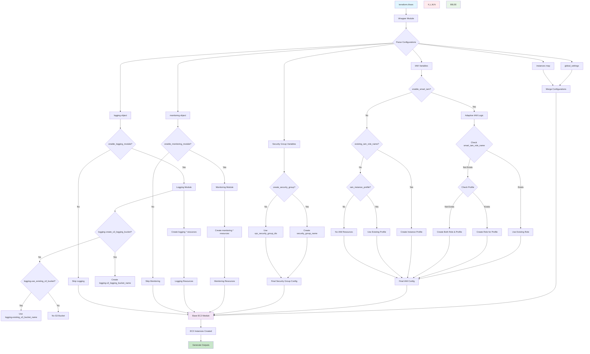

# EC2 Wrapper Module

A dynamic Terraform wrapper module for creating multiple EC2 instances with comprehensive configuration options, IAM management, and adaptive resource handling.

## 🎯 Features

- **Dynamic instance creation** - Create multiple instances with different configurations using `for_each` loops
- **Global defaults with instance overrides** - Set common configurations globally and override per instance
- **Adaptive IAM management** - Automatically detects existing resources and creates missing ones
- **Comprehensive configuration** - All base module variables exposed via `tfvars`
- **Monitoring & Logging integration** - Optional CloudWatch monitoring and centralized logging

## 🏗️ System Architecture Flowchart



## ⚙️ Configuration

### **Basic Usage**

```hcl
# terraform.tfvars
aws_region = "us-west-2"
environment = "production"
project_name = "my-project"

# Instance configurations
instances = {
  web-server = {
    name = "web-server-01"
    ami = "ami-12345678"
    instance_type = "t3.micro"
    subnet_id = "subnet-12345678"
    vpc_security_group_ids = ["sg-12345678"]
    tags = {
      Role = "web-server"
    }
  }
  
  db-server = {
    name = "db-server-01"
    ami = "ami-87654321"
    instance_type = "t3.small"
    subnet_id = "subnet-87654321"
    vpc_security_group_ids = ["sg-87654321"]
    tags = {
      Role = "database"
    }
  }
}
```

### **Global Settings**

```hcl
global_settings = {
  enable_monitoring = true
  enable_ebs_optimization = true
  additional_tags = {
    Environment = "production"
    Project = "my-project"
  }
}
```

### **Adaptive IAM (Auto-Detection)**

```hcl
# Automatically detects existing resources and creates missing ones
enable_smart_iam = true
smart_iam_role_name = "ec2-instance-role"
smart_iam_role_tags = {
  Purpose = "EC2 Instance Access"
}
```

### **Security Groups**

```hcl
# Create new security group
create_security_group = true
security_group_name = "web-server-sg"
security_group_tags = {
  Purpose = "Web Server Access"
}

# OR use existing security groups
create_security_group = false
vpc_security_group_ids = ["sg-12345678", "sg-87654321"]
```

### **Monitoring Module**

```hcl
enable_monitoring_module = true
monitoring = {
  create_cloudwatch_agent_role = true
  cloudwatch_agent_role_name = "monitoring-role"
  create_dashboard = true
  dashboard_name = "app-dashboard"
  create_cpu_alarms = true
  cpu_alarm_name = "cpu-alarm"
}
```

### **Logging Module**

```hcl
enable_logging_module = true
logging = {
  # Create new S3 bucket
  create_s3_logging_bucket = true
  s3_logging_bucket_name = "my-logs-bucket"
  
  # OR use existing S3 bucket
  # create_s3_logging_bucket = false
  # use_existing_s3_bucket = true
  # existing_s3_bucket_name = "my-existing-logs-bucket"
  
  create_logging_iam_role = true
  logging_iam_role_name = "logging-role"
}
```

## 📋 Key Variables

| Variable | Type | Description |
|----------|------|-------------|
| `instances` | `map(object)` | Map of instance configurations |
| `global_settings` | `object` | Global settings applied to all instances |
| `enable_smart_iam` | `bool` | Enable adaptive IAM auto-detection |
| `smart_iam_role_name` | `string` | Role name for adaptive IAM |
| `create_security_group` | `bool` | Create new security group |
| `security_group_name` | `string` | Name for new security group |
| `enable_monitoring_module` | `bool` | Enable monitoring module |
| `enable_logging_module` | `bool` | Enable logging module |

## 🚀 Quick Start

1. **Create terraform.tfvars file** with your configuration
2. **Initialize Terraform:**
   ```bash
   terraform init
   ```
3. **Plan deployment:**
   ```bash
   terraform plan
   ```
4. **Apply configuration:**
   ```bash
   terraform apply
   ```

## 📤 Outputs

- `instance_ids` - IDs of created EC2 instances
- `instance_private_ips` - Private IP addresses
- `instance_public_ips` - Public IP addresses
- `iam_role_arn` - ARN of created IAM role
- `security_group_id` - ID of created security group
- `monitoring_enabled` - Whether monitoring is enabled
- `logging_enabled` - Whether logging is enabled

## 📁 Examples

See the `examples/` directory for complete configuration examples:
- `basic-instances.tfvars` - Basic EC2 instances
- `with-monitoring.tfvars` - With monitoring enabled
- `with-logging.tfvars` - With logging enabled
- `adaptive-iam.tfvars` - With adaptive IAM
- `existing-resources.tfvars` - Using existing resources