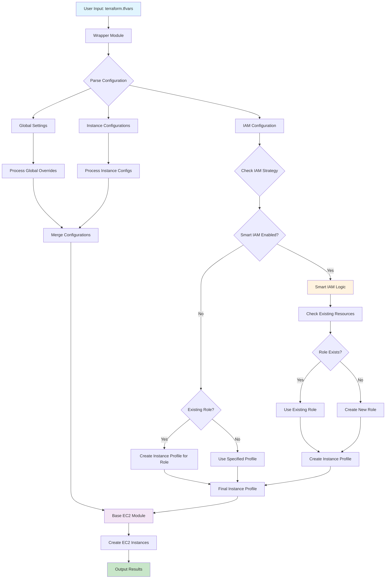
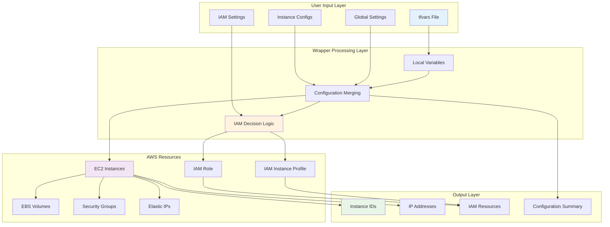

# EC2 Instance Wrapper Module

A dynamic, zero-hardcoded Terraform wrapper module for creating multiple EC2 instances with comprehensive configuration options, IAM management, and intelligent resource handling.

## 📋 Table of Contents

- [Overview](#overview)
- [Architecture & Flow](#architecture--flow)
- [Resource Mapping](#resource-mapping)
- [Features](#features)
- [Quick Start](#quick-start)
- [Configuration](#configuration)
- [Examples](#examples)
- [Outputs](#outputs)
- [Advanced Features](#advanced-features)
- [Troubleshooting](#troubleshooting)

## 🎯 Overview

This wrapper module provides a dynamic, loop-based approach to creating EC2 instances with:
- **Zero hardcoded values** - Everything configurable via `tfvars`
- **Dynamic instance creation** - Create multiple instances with different configurations
- **Intelligent IAM management** - Smart handling of existing vs new IAM resources
- **Comprehensive configuration** - All base module variables exposed
- **Template-based user data** - Dynamic user data generation

## 🏗️ Architecture & Flow

### System Flowchart



### Resource Relationship Diagram



## 🔗 Resource Mapping

### 1. **Input Variables → Local Processing**

| Input Variable | Local Variable | Purpose | Example |
|----------------|----------------|---------|---------|
| `instances` | `local.merged_instances` | Instance configurations | `{web_server = {...}}` |
| `global_settings` | `local.merged_instances` | Global overrides | `{monitoring = true}` |
| `iam_instance_profile` | `local.instance_profile_name` | IAM profile selection | `"my-profile"` |

### 2. **IAM Resource Mapping**

| Feature | Data Source | Resource | Output |
|---------|-------------|----------|--------|
| **Existing Role** | `aws_iam_role.existing` | `aws_iam_instance_profile.existing_role` | `iam_instance_profile_name` |
| **Smart IAM** | `aws_iam_role.smart_existing_role` | `aws_iam_role.smart_role` | `smart_iam_role_name` |
| **Smart Profile** | `aws_iam_instance_profile.smart_existing_profile` | `aws_iam_instance_profile.smart_profile` | `smart_iam_instance_profile_name` |

### 3. **EC2 Instance Mapping**

| Instance Config | Base Module Variable | AWS Resource | Output |
|-----------------|---------------------|--------------|--------|
| `name` | `name` | `aws_instance.this` | `instance_ids` |
| `ami` | `ami` | `aws_instance.this` | `instance_arns` |
| `instance_type` | `instance_type` | `aws_instance.this` | `instance_configurations` |
| `root_block_device` | `root_block_device` | `aws_instance.this` | `instance_availability_zones` |
| `ebs_volumes` | `ebs_volumes` | `aws_instance.this` | `instance_private_ips` |

### 4. **Network Resource Mapping**

| Configuration | Base Module Variable | AWS Resource | Purpose |
|---------------|---------------------|--------------|---------|
| `subnet_id` | `subnet_id` | `aws_instance.this` | Instance placement |
| `vpc_security_group_ids` | `vpc_security_group_ids` | `aws_instance.this` | Security rules |
| `associate_public_ip_address` | `associate_public_ip_address` | `aws_instance.this` | Public access |
| `create_eip` | `create_eip` | `aws_eip.this` | Static IP |

### 5. **User Data Template Mapping**

| Input | Processing | Output | Purpose |
|-------|------------|--------|---------|
| `user_data_template_path` | `templatefile()` | `user_data_base64` | Dynamic scripts |
| `user_data_template_vars` | Variable substitution | Processed template | Instance-specific data |
| `enable_user_data_template` | Conditional logic | Base64 encoded | Boot configuration |

## ✨ Features

### 🎯 **Core Features**
- **Dynamic Instance Creation** - Create multiple instances with different configurations
- **Zero Hardcoded Values** - Everything configurable via `tfvars`
- **Template-based User Data** - Dynamic user data generation
- **Comprehensive Variable Exposure** - All base module variables available

### 🔐 **IAM Management Features**
- **Existing IAM Role Support** - Use existing roles with instance profile creation
- **Smart IAM (Toggle Feature)** - Intelligent IAM resource management
- **Instance Profile Management** - Flexible instance profile handling

### 🛡️ **Security Features**
- **Encrypted EBS Volumes** - Default encryption for all volumes
- **IMDSv2 Support** - Secure metadata access
- **Security Group Integration** - Flexible security group assignment
- **IAM Role Integration** - Secure instance permissions

### 💰 **Cost Optimization**
- **Spot Instance Support** - Cost-effective instance types
- **EBS Optimization** - Optimized storage performance
- **Monitoring Configuration** - CloudWatch integration
- **Instance Scheduling** - Start/stop optimization

## 🚀 Quick Start

### 1. **Basic Usage**

```hcl
# main.tf
module "ec2_instances" {
  source = "./wrapper"
  
  aws_region = "us-west-2"
  environment = "production"
  project_name = "my-app"
  
  instances = {
    web_server = {
      name = "web-server"
      ami = "ami-0c02fb55956c7d316"
      instance_type = "t3.micro"
      subnet_id = "subnet-1234567890abcdef0"
      vpc_security_group_ids = ["sg-1234567890abcdef0"]
      associate_public_ip_address = true
      key_name = "my-key-pair"
    }
  }
}
```

### 2. **Apply Configuration**

```bash
terraform init
terraform plan
terraform apply
```

## ⚙️ Configuration

### **Instance Configuration Structure**

```hcl
instances = {
  instance_key = {
    # Basic Configuration
    name                        = "instance-name"
    ami                         = "ami-id"
    instance_type              = "t3.micro"
    availability_zone          = "us-west-2a"
    subnet_id                  = "subnet-id"
    vpc_security_group_ids     = ["sg-id"]
    associate_public_ip_address = true
    key_name                   = "key-pair-name"
    
    # User Data Template
    user_data_template_vars = {
      hostname = "web-server"
      role     = "web"
    }
    
    # Storage Configuration
    root_block_device = {
      size       = 20
      type       = "gp3"
      encrypted  = true
      throughput = 125
    }
    
    ebs_volumes = {
      "/dev/sdf" = {
        size       = 100
        type       = "gp3"
        encrypted  = true
        throughput = 125
      }
    }
    
    # IAM Configuration
    create_iam_instance_profile = false
    iam_role_policies          = {}
    
    # Instance Settings
    disable_api_stop       = false
    disable_api_termination = false
    ebs_optimized          = true
    monitoring             = true
    
    # Metadata Options
    metadata_options = {
      http_endpoint               = "enabled"
      http_tokens                 = "required"
      http_put_response_hop_limit = 1
      instance_metadata_tags      = "enabled"
    }
    
    # Tags
    tags = {
      Name = "web-server"
      Role = "web"
    }
  }
}
```

### **Global Settings**

```hcl
global_settings = {
  enable_monitoring = true
  enable_ebs_optimization = true
  enable_termination_protection = false
  enable_stop_protection = false
  create_iam_profiles = false
  iam_role_policies = {}
  additional_tags = {
    Owner = "DevOps Team"
    CostCenter = "IT-001"
  }
}
```

### **IAM Configuration Options**

#### **1. Use Existing IAM Instance Profile**
```hcl
iam_instance_profile = "my-existing-instance-profile"
create_instance_profile_for_existing_role = false
enable_smart_iam = false
```

#### **2. Create Instance Profile for Existing Role**
```hcl
create_instance_profile_for_existing_role = true
existing_iam_role_name = "my-existing-role"
instance_profile_name = "my-new-instance-profile"
```

#### **3. Smart IAM (Toggle Feature)**
```hcl
enable_smart_iam = true
smart_iam_role_name = "smart-ec2-role"
smart_iam_role_policies = {
  s3_access = var.environment == "prod" ? "arn:aws:iam::aws:policy/AmazonS3FullAccess" : "arn:aws:iam::aws:policy/AmazonS3ReadOnlyAccess"
  cloudwatch = "arn:aws:iam::aws:policy/CloudWatchAgentServerPolicy"
}
```

## 📚 Examples

### **1. Simple Web Application**
```bash
# Copy example
cp examples/simple-usage.tf main.tf
cp terraform.tfvars.example terraform.tfvars

# Update configuration
terraform plan
terraform apply
```

### **2. Dynamic Multi-Environment**
```bash
# Copy example
cp examples/dynamic-instances.tf main.tf
cp terraform.tfvars.example terraform.tfvars

# Update environment configuration
terraform plan
terraform apply
```

### **3. IAM Instance Profile for Existing Role**
```bash
# Copy example
cp examples/iam-instance-profile.tf main.tf
cp terraform.tfvars.example terraform.tfvars

# Update IAM role name
terraform plan
terraform apply
```

### **4. Smart IAM (Toggle Feature)**
```bash
# Copy example
cp examples/smart-iam.tf main.tf
cp terraform.tfvars.example terraform.tfvars

# Enable smart IAM
terraform plan
terraform apply
```

### **5. Existing IAM with Instance Profile**
```bash
# Copy example
cp examples/simple-existing-iam.tfvars terraform.tfvars

# Update instance profile name
terraform plan
terraform apply
```

## 📤 Outputs

### **Instance Information**
- `instance_ids` - List of created instance IDs
- `instance_private_ips` - Private IP addresses
- `instance_public_ips` - Public IP addresses
- `instance_availability_zones` - Instance AZs
- `instance_arns` - Instance ARNs
- `instance_tags` - Instance tags

### **IAM Resources**
- `iam_instance_profile_arn` - Instance profile ARN
- `iam_instance_profile_name` - Instance profile name
- `smart_iam_role_arn` - Smart IAM role ARN (if created)
- `smart_iam_instance_profile_arn` - Smart instance profile ARN

### **Configuration Summary**
- `total_instances` - Total number of instances
- `instance_configurations` - Instance configurations
- `instances_by_role` - Instances grouped by role
- `final_instance_profile_used` - Final instance profile name
- `smart_iam_decision` - Smart IAM decision logic

## 🔧 Advanced Features

### **1. Template-based User Data**

Create custom user data templates:

```bash
# templates/custom_user_data.sh
#!/bin/bash
set -e

# Set hostname
hostnamectl set-hostname ${hostname}

# Install packages based on role
case "${role}" in
  "web")
    yum install -y nginx
    systemctl enable nginx
    systemctl start nginx
    ;;
  "application")
    yum install -y java-11-amazon-corretto
    ;;
  "database")
    yum install -y mysql
    ;;
esac
```

### **2. Dynamic Instance Creation**

```hcl
locals {
  env_configs = {
    dev = {
      instance_count = 2
      instance_type = "t3.micro"
    }
    prod = {
      instance_count = 5
      instance_type = "t3.medium"
    }
  }
  
  all_instances = merge(
    [for env, config in local.env_configs : {
      for i in range(config.instance_count) : "${env}-web-${i + 1}" => {
        name = "${env}-web-${i + 1}"
        instance_type = config.instance_type
        # ... other configuration
      }
    }]...
  )
}
```

### **3. Conditional IAM Creation**

```hcl
# Smart IAM with conditional policies
smart_iam_role_policies = {
  s3_access = var.environment == "prod" ? "arn:aws:iam::aws:policy/AmazonS3FullAccess" : "arn:aws:iam::aws:policy/AmazonS3ReadOnlyAccess"
  cloudwatch = "arn:aws:iam::aws:policy/CloudWatchAgentServerPolicy"
}
```

## 🛠️ Troubleshooting

### **Common Issues**

#### **1. IAM Role Not Found**
```
Error: No IAM role found with name "my-role"
```
**Solution**: Verify the IAM role exists and check the role name in your configuration.

#### **2. Instance Profile Already Exists**
```
Error: Instance profile "my-profile" already exists
```
**Solution**: Use `enable_smart_iam = true` or specify a different profile name.

#### **3. Subnet Not Found**
```
Error: No subnet found with id "subnet-123"
```
**Solution**: Verify the subnet ID exists in the specified region and AZ.

#### **4. Security Group Not Found**
```
Error: No security group found with id "sg-123"
```
**Solution**: Verify the security group exists and is in the correct VPC.

### **Debug Commands**

```bash
# Check configuration
terraform validate

# Plan with detailed output
terraform plan -detailed-exitcode

# Show current state
terraform show

# Check specific resource
terraform state show module.ec2_instances.aws_instance.this["web_server"]
```

### **Log Analysis**

```bash
# Check Terraform logs
export TF_LOG=DEBUG
terraform plan 2>&1 | tee terraform.log

# Check AWS CLI for resource verification
aws ec2 describe-instances --instance-ids i-1234567890abcdef0
aws iam get-instance-profile --instance-profile-name my-profile
```

## 📋 Best Practices

### **1. Security**
- Always use IMDSv2 (`http_tokens = "required"`)
- Enable EBS encryption by default
- Use least-privilege IAM policies
- Implement proper security group rules

### **2. Cost Optimization**
- Use appropriate instance types
- Enable EBS optimization for I/O intensive workloads
- Consider spot instances for non-critical workloads
- Implement proper tagging for cost allocation

### **3. Monitoring**
- Enable detailed monitoring for production instances
- Use CloudWatch for performance monitoring
- Implement proper logging and alerting

### **4. Maintenance**
- Use consistent naming conventions
- Implement proper tagging strategy
- Regular security updates and patches
- Backup and disaster recovery planning

## 🤝 Contributing

1. Fork the repository
2. Create a feature branch
3. Make your changes
4. Add tests if applicable
5. Submit a pull request

## 📄 License

This project is licensed under the MIT License - see the LICENSE file for details.

## 🆘 Support

For support and questions:
- Create an issue in the repository
- Check the troubleshooting section
- Review the examples directory
- Consult the Terraform documentation

---

**Note**: This wrapper module is designed to be flexible and comprehensive. Always test configurations in a non-production environment first.