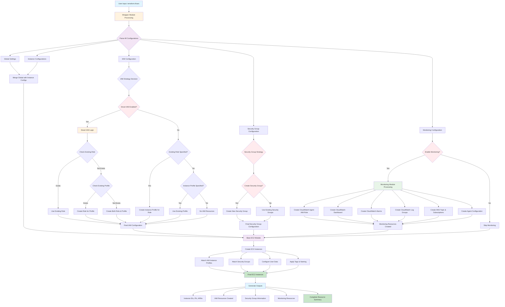
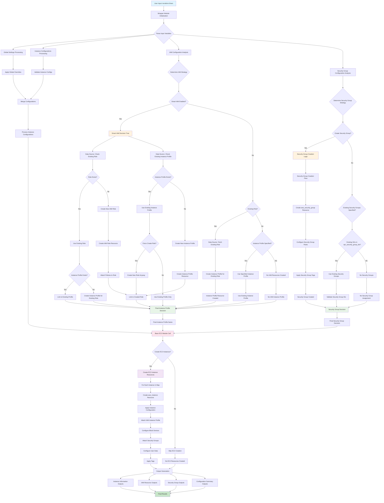
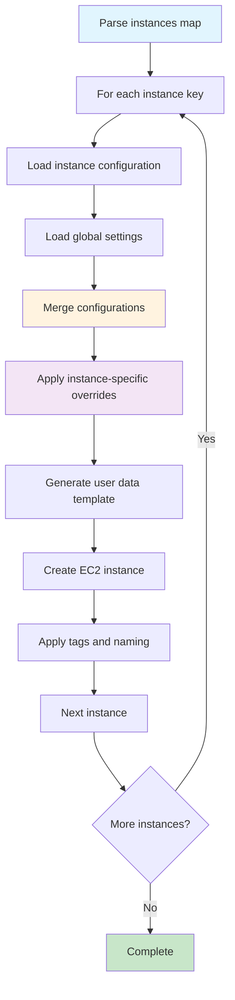
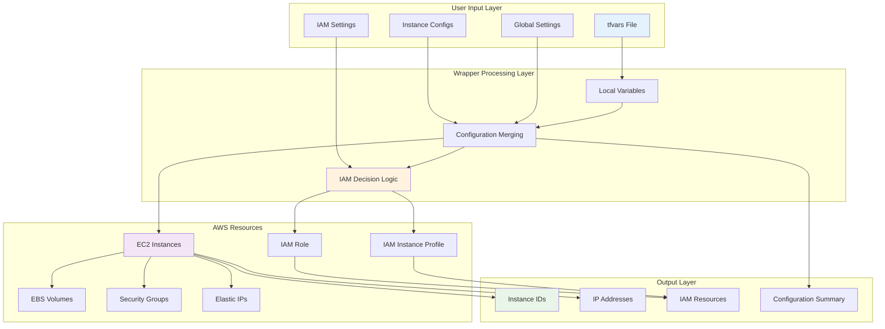

# EC2 Instance Wrapper Module

A dynamic, zero-hardcoded Terraform wrapper module for creating multiple EC2 instances with comprehensive configuration options, IAM management, and intelligent resource handling.

## 📋 Table of Contents

- [Overview](#overview)
- [Architecture & Flow](#architecture--flow)
- [Loop Functionality & Defaults](#loop-functionality--defaults)
- [Resource Mapping](#resource-mapping)
- [Features](#features)
- [Quick Start](#quick-start)
- [Configuration](#configuration)
- [Examples](#examples)
- [Outputs](#outputs)
- [Advanced Features](#advanced-features)
- [Troubleshooting](#troubleshooting)

## 🎯 Overview

This wrapper module provides a dynamic, loop-based approach to creating EC2 instances with:
- **Zero hardcoded values** - Everything configurable via `tfvars`
- **Dynamic instance creation** - Create multiple instances with different configurations using `for_each` loops
- **Global defaults with instance overrides** - Set common configurations globally and override per instance
- **Intelligent IAM management** - Smart handling of existing vs new IAM resources
- **Comprehensive configuration** - All base module variables exposed
- **Template-based user data** - Dynamic user data generation

## 🏗️ Architecture & Flow

### 📖 How to Read These Flowcharts

The flowcharts below show the complete end-to-end resource creation logic for the wrapper module. Here's how to interpret them:

#### **🔍 Flowchart Elements:**
- **🟦 Blue Boxes**: Input/Output points
- **🟨 Yellow Boxes**: Decision points (Smart IAM logic)
- **🟪 Purple Boxes**: Processing steps
- **🟩 Green Boxes**: Resource creation
- **🟧 Orange Boxes**: Final results
- **🔴 Red Boxes**: Error conditions

#### **📊 Decision Points:**
- **Diamond shapes**: Conditional logic (Yes/No decisions)
- **Rectangle shapes**: Processing steps
- **Rounded rectangles**: Start/End points

#### **🔄 Flow Direction:**
- **Top to Bottom**: Main flow direction
- **Left to Right**: Alternative paths
- **Arrows**: Data/control flow

### Complete System Architecture Flowchart






### Complete Resource Creation Decision Matrix


## 🔄 Loop Functionality & Defaults

### 🎯 **How the Loop System Works**

The wrapper module uses Terraform's `for_each` meta-argument to create multiple EC2 instances with different configurations. This provides:

#### **✅ Dynamic Instance Creation:**
```hcl
# Each key in the instances map becomes a separate EC2 instance
instances = {
  web_server = { ... }    # Creates: web-server instance
  app_server = { ... }    # Creates: app-server instance  
  db_server = { ... }     # Creates: db-server instance
}
```

#### **✅ Global Defaults with Instance Overrides:**
```hcl
# Global settings apply to all instances
global_settings = {
  enable_monitoring = true
  enable_ebs_optimization = true
  iam_role_policies = {
    SSMManagedInstanceCore = "arn:aws:iam::aws:policy/AmazonSSMManagedInstanceCore"
  }
  additional_tags = {
    Environment = "production"
    ManagedBy = "terraform"
  }
}

# Instance-specific settings override globals
instances = {
  web_server = {
    # Inherits global settings but can override
    monitoring = true  # Override global setting
    tags = {
      Name = "web-server"  # Instance-specific tag
      Role = "web"         # Instance-specific tag
    }
  }
}
```

### 🔧 **Configuration Merging Logic**

The wrapper uses intelligent merging to combine global and instance-specific configurations:

#### **✅ Priority Order:**
1. **Instance-specific settings** (highest priority)
2. **Global settings** (medium priority)
3. **Module defaults** (lowest priority)

#### **✅ Merging Examples:**

**IAM Policies:**
```hcl
# Global policies
global_settings.iam_role_policies = {
  SSMManagedInstanceCore = "arn:aws:iam::aws:policy/AmazonSSMManagedInstanceCore"
}

# Instance-specific policies
instances.web_server.iam_role_policies = {
  CloudWatchAgentServerPolicy = "arn:aws:iam::aws:policy/CloudWatchAgentServerPolicy"
}

# Result: Both policies are merged
# Final policies = SSMManagedInstanceCore + CloudWatchAgentServerPolicy
```

**Tags:**
```hcl
# Global tags
global_settings.additional_tags = {
  Environment = "production"
  ManagedBy = "terraform"
}

# Instance-specific tags
instances.web_server.tags = {
  Name = "web-server"
  Role = "web"
}

# Result: All tags are merged
# Final tags = Environment + ManagedBy + Name + Role
```

### 📊 **Loop Processing Flow**



### 🎛️ **Configuration Examples**

#### **✅ Simple Loop Example:**
```hcl
instances = {
  server1 = {
    name = "server-1"
    ami = "ami-123456"
    instance_type = "t3.micro"
    # ... other required settings
  }
  server2 = {
    name = "server-2"
    ami = "ami-123456"
    instance_type = "t3.small"
    # ... other required settings
  }
}
```

#### **✅ Advanced Loop with Defaults:**
```hcl
# Global defaults
global_settings = {
  enable_monitoring = true
  enable_ebs_optimization = true
  iam_role_policies = {
    SSMManagedInstanceCore = "arn:aws:iam::aws:policy/AmazonSSMManagedInstanceCore"
  }
  additional_tags = {
    Environment = "production"
    Team = "DevOps"
  }
}

# Multiple instances with overrides
instances = {
  web = {
    name = "web-server"
    instance_type = "t3.micro"
    # Inherits global settings
    tags = {
      Name = "web-server"
      Role = "web"
    }
  }
  app = {
    name = "app-server"
    instance_type = "t3.small"
    # Override global monitoring
    monitoring = false
    tags = {
      Name = "app-server"
      Role = "application"
    }
  }
  db = {
    name = "db-server"
    instance_type = "t3.medium"
    # Override global termination protection
    disable_api_termination = true
    tags = {
      Name = "db-server"
      Role = "database"
    }
  }
}
```

### 🔄 **Resource Creation with Loops**

Each instance in the loop creates:

#### **✅ Individual Resources:**
- **EC2 Instance** - `aws_instance.this[instance_name]`
- **Root Block Device** - `aws_instance.this[instance_name].root_block_device`
- **EBS Volumes** - `aws_instance.this[instance_name].ebs_block_device`
- **Instance Tags** - Merged from global + instance-specific

#### **✅ Shared Resources:**
- **Security Groups** - Created once, attached to all instances
- **IAM Roles/Profiles** - Created once, used by all instances
- **Monitoring Resources** - Created once, monitor all instances

### 📈 **Benefits of Loop System**

#### **✅ Scalability:**
- Create 1 to 100+ instances with single configuration
- Consistent configuration across all instances
- Easy to add/remove instances

#### **✅ Maintainability:**
- Single source of truth for common settings
- Instance-specific overrides when needed
- DRY (Don't Repeat Yourself) principle

#### **✅ Flexibility:**
- Different instance types per instance
- Different storage configurations
- Different user data templates
- Different tagging strategies

### Resource Relationship Diagram



## 🔗 Resource Mapping

### 1. **Input Variables → Local Processing**

| Input Variable | Local Variable | Purpose | Example |
|----------------|----------------|---------|---------|
| `instances` | `local.merged_instances` | Instance configurations | `{web_server = {...}}` |
| `global_settings` | `local.merged_instances` | Global overrides | `{monitoring = true}` |
| `iam_instance_profile` | `local.instance_profile_name` | IAM profile selection | `"my-profile"` |

### 2. **IAM Resource Mapping**

| Feature | Data Source | Resource | Output |
|---------|-------------|----------|--------|
| **Existing Role** | `aws_iam_role.existing` | `aws_iam_instance_profile.existing_role` | `iam_instance_profile_name` |
| **Smart IAM** | `aws_iam_role.smart_existing_role` | `aws_iam_role.smart_role` | `smart_iam_role_name` |
| **Smart Profile** | `aws_iam_instance_profile.smart_existing_profile` | `aws_iam_instance_profile.smart_profile` | `smart_iam_instance_profile_name` |

### 3. **EC2 Instance Mapping**

| Instance Config | Base Module Variable | AWS Resource | Output |
|-----------------|---------------------|--------------|--------|
| `name` | `name` | `aws_instance.this` | `instance_ids` |
| `ami` | `ami` | `aws_instance.this` | `instance_arns` |
| `instance_type` | `instance_type` | `aws_instance.this` | `instance_configurations` |
| `root_block_device` | `root_block_device` | `aws_instance.this` | `instance_availability_zones` |
| `ebs_volumes` | `ebs_volumes` | `aws_instance.this` | `instance_private_ips` |

### 4. **Network Resource Mapping**

| Configuration | Base Module Variable | AWS Resource | Purpose |
|---------------|---------------------|--------------|---------|
| `subnet_id` | `subnet_id` | `aws_instance.this` | Instance placement |
| `vpc_security_group_ids` | `vpc_security_group_ids` | `aws_instance.this` | Security rules |
| `associate_public_ip_address` | `associate_public_ip_address` | `aws_instance.this` | Public access |
| `create_eip` | `create_eip` | `aws_eip.this` | Static IP |

### 4.1. **Security Group Resource Mapping**

| Configuration | Base Module Variable | AWS Resource | Purpose |
|---------------|---------------------|--------------|---------|
| `create_security_group` | `create_security_group` | `aws_security_group.this` | Create new security group |
| `security_group_name` | `security_group_name` | `aws_security_group.this` | Security group name |
| `security_group_description` | `security_group_description` | `aws_security_group.this` | Security group description |
| `security_group_vpc_id` | `security_group_vpc_id` | `aws_security_group.this` | VPC for security group |
| `security_group_ingress_rules` | `security_group_ingress_rules` | `aws_security_group_rule.ingress` | Inbound rules |
| `security_group_egress_rules` | `security_group_egress_rules` | `aws_security_group_rule.egress` | Outbound rules |
| `vpc_security_group_ids` | `vpc_security_group_ids` | `aws_instance.this` | Attach existing security groups |

### 5. **User Data Template Mapping**

| Input | Processing | Output | Purpose |
|-------|------------|--------|---------|
| `user_data_template_path` | `templatefile()` | `user_data_base64` | Dynamic scripts |
| `user_data_template_vars` | Variable substitution | Processed template | Instance-specific data |
| `enable_user_data_template` | Conditional logic | Base64 encoded | Boot configuration |

### 6. **Complete Resource Creation Summary**

| Input Scenario | IAM Resources Created | Security Group Resources Created | EC2 Resources Created | Final Instance Profile | Final Security Groups |
|----------------|----------------------|----------------------------------|----------------------|----------------------|----------------------|
| **Smart IAM: Role exists, Profile exists** | None | `aws_security_group.this` (if create_security_group=true) | `aws_instance.this[*]` | Existing Profile | Created or Existing SGs |
| **Smart IAM: Role exists, Profile missing** | `aws_iam_instance_profile.smart_profile` | `aws_security_group.this` (if create_security_group=true) | `aws_instance.this[*]` | Created Profile | Created or Existing SGs |
| **Smart IAM: Role missing, Profile exists** | `aws_iam_role.smart_role` + `aws_iam_role_policy_attachment.smart_policies` | `aws_security_group.this` (if create_security_group=true) | `aws_instance.this[*]` | Existing Profile | Created or Existing SGs |
| **Smart IAM: Both missing** | `aws_iam_role.smart_role` + `aws_iam_instance_profile.smart_profile` + `aws_iam_role_policy_attachment.smart_policies` | `aws_security_group.this` (if create_security_group=true) | `aws_instance.this[*]` | Created Profile | Created or Existing SGs |
| **Existing Role: Role specified** | `aws_iam_instance_profile.existing_role` | `aws_security_group.this` (if create_security_group=true) | `aws_instance.this[*]` | Created Profile | Created or Existing SGs |
| **Existing Role: Profile specified** | None | `aws_security_group.this` (if create_security_group=true) | `aws_instance.this[*]` | Specified Profile | Created or Existing SGs |
| **No IAM: No configuration** | None | `aws_security_group.this` (if create_security_group=true) | `aws_instance.this[*]` | None | Created or Existing SGs |
| **Disabled: create = false** | None | None | None | None | None |

### 7. **Resource Creation Decision Logic**

| Configuration | Smart IAM | Existing Role | Instance Profile | Result |
|---------------|-----------|---------------|------------------|--------|
| `enable_smart_iam = true` | ✅ | Any | Any | Smart decision based on existing resources |
| `enable_smart_iam = false` + `existing_iam_role_name = "role"` | ❌ | ✅ | ❌ | Create instance profile for existing role |
| `enable_smart_iam = false` + `iam_instance_profile = "profile"` | ❌ | ❌ | ✅ | Use existing instance profile |
| `enable_smart_iam = false` + No IAM config | ❌ | ❌ | ❌ | No IAM resources created |
| `create = false` | Any | Any | Any | No resources created |

## ✨ Features

### 🎯 **Core Features**
- **Dynamic Instance Creation** - Create multiple instances with different configurations using `for_each` loops
- **Global Defaults with Instance Overrides** - Set common configurations globally and override per instance
- **Zero Hardcoded Values** - Everything configurable via `tfvars`
- **Template-based User Data** - Dynamic user data generation
- **Comprehensive Variable Exposure** - All base module variables available
- **Maximum Naming & Tagging** - Complete control over resource naming and tagging with extensive options

### 🔐 **IAM Management Features**
- **Existing IAM Role Support** - Use existing roles with instance profile creation
- **Smart IAM (Toggle Feature)** - Intelligent IAM resource management
- **Instance Profile Management** - Flexible instance profile handling

### 🛡️ **Security Features**
- **Encrypted EBS Volumes** - Default encryption for all volumes
- **IMDSv2 Support** - Secure metadata access
- **Security Group Integration** - Flexible security group assignment
- **IAM Role Integration** - Secure instance permissions

### 💰 **Cost Optimization**
- **Spot Instance Support** - Cost-effective instance types
- **EBS Optimization** - Optimized storage performance
- **Monitoring Configuration** - CloudWatch integration
- **Instance Scheduling** - Start/stop optimization

## 🚀 Quick Start

### 1. **Basic Usage**

```hcl
# main.tf
module "ec2_instances" {
  source = "./wrapper"
  
  aws_region = "us-west-2"
  environment = "production"
  project_name = "my-app"
  
  instances = {
    web_server = {
      name = "web-server"
      ami = "ami-0c02fb55956c7d316"
      instance_type = "t3.micro"
      subnet_id = "subnet-1234567890abcdef0"
      vpc_security_group_ids = ["sg-1234567890abcdef0"]
      associate_public_ip_address = true
      key_name = "my-key-pair"
    }
  }
}
```

### 2. **Apply Configuration**

```bash
terraform init
terraform plan
terraform apply
```

## ⚙️ Configuration

### **Instance Configuration Structure**

```hcl
instances = {
  instance_key = {
    # Basic Configuration
    name                        = "instance-name"
    ami                         = "ami-id"
    instance_type              = "t3.micro"
    availability_zone          = "us-west-2a"
    subnet_id                  = "subnet-id"
    vpc_security_group_ids     = ["sg-id"]
    associate_public_ip_address = true
    key_name                   = "key-pair-name"
    
    # User Data Template
    user_data_template_vars = {
      hostname = "web-server"
      role     = "web"
    }
    
    # Storage Configuration
    root_block_device = {
      size       = 20
      type       = "gp3"
      encrypted  = true
      throughput = 125
    }
    
    ebs_volumes = {
      "/dev/sdf" = {
        size       = 100
        type       = "gp3"
        encrypted  = true
        throughput = 125
      }
    }
    
    # IAM Configuration
    create_iam_instance_profile = false
    iam_role_policies          = {}
    
    # Instance Settings
    disable_api_stop       = false
    disable_api_termination = false
    ebs_optimized          = true
    monitoring             = true
    
    # Metadata Options
    metadata_options = {
      http_endpoint               = "enabled"
      http_tokens                 = "required"
      http_put_response_hop_limit = 1
      instance_metadata_tags      = "enabled"
    }
    
    # Tags
    tags = {
      Name = "web-server"
      Role = "web"
    }
  }
}
```

### **Global Settings**

```hcl
global_settings = {
  enable_monitoring = true
  enable_ebs_optimization = true
  enable_termination_protection = false
  enable_stop_protection = false
  create_iam_profiles = false
  iam_role_policies = {}
  additional_tags = {
    Owner = "DevOps Team"
    CostCenter = "IT-001"
  }
}
```

### **IAM Configuration Options**

#### **1. Use Existing IAM Instance Profile**
```hcl
iam_instance_profile = "my-existing-instance-profile"
create_instance_profile_for_existing_role = false
enable_smart_iam = false
```

#### **2. Create Instance Profile for Existing Role**
```hcl
create_instance_profile_for_existing_role = true
existing_iam_role_name = "my-existing-role"
instance_profile_name = "my-new-instance-profile"
```

#### **3. Smart IAM (Toggle Feature)**
```hcl
enable_smart_iam = true
smart_iam_role_name = "smart-ec2-role"
smart_iam_role_policies = {
  s3_access = var.environment == "prod" ? "arn:aws:iam::aws:policy/AmazonS3FullAccess" : "arn:aws:iam::aws:policy/AmazonS3ReadOnlyAccess"
  cloudwatch = "arn:aws:iam::aws:policy/CloudWatchAgentServerPolicy"
}
```

### **Security Group Configuration Options**

#### **1. Use Existing Security Groups**
```hcl
# In instances configuration
instances = {
  web_server = {
    # ... other configuration ...
    vpc_security_group_ids = ["sg-1234567890abcdef0", "sg-0987654321fedcba0"]
    create_security_group = false
  }
}
```

#### **2. Create New Security Group**
```hcl
# Global security group configuration
create_security_group = true
security_group_name = "my-ec2-security-group"
security_group_description = "Security group for EC2 instances"
security_group_vpc_id = "vpc-1234567890abcdef0"

security_group_ingress_rules = {
  ssh = {
    from_port   = 22
    to_port     = 22
    ip_protocol = "tcp"
    cidr_ipv4   = "10.0.0.0/8"
    description = "SSH access"
  }
  http = {
    from_port   = 80
    to_port     = 80
    ip_protocol = "tcp"
    cidr_ipv4   = "0.0.0.0/0"
    description = "HTTP access"
  }
  https = {
    from_port   = 443
    to_port     = 443
    ip_protocol = "tcp"
    cidr_ipv4   = "0.0.0.0/0"
    description = "HTTPS access"
  }
}

security_group_egress_rules = {
  all_traffic = {
    from_port   = 0
    to_port     = 0
    ip_protocol = "-1"
    cidr_ipv4   = "0.0.0.0/0"
    description = "Allow all outbound traffic"
  }
}
```

#### **3. Mixed Approach (Create + Existing)**
```hcl
# Create a new security group
create_security_group = true
security_group_name = "my-new-security-group"
security_group_ingress_rules = {
  ssh = {
    from_port   = 22
    to_port     = 22
    ip_protocol = "tcp"
    cidr_ipv4   = "10.0.0.0/8"
  }
}

# In instances, use both created and existing security groups
instances = {
  web_server = {
    # ... other configuration ...
    vpc_security_group_ids = ["sg-existing-123", "sg-existing-456"]  # Will be merged with created SG
  }
}
```

#### **4. Security Group Toggle Feature (Proposed)**
```hcl
# Enable smart security group handling
enable_smart_security_group = true
smart_security_group_name = "smart-ec2-sg"
smart_security_group_vpc_id = "vpc-1234567890abcdef0"

# The wrapper will:
# 1. Check if security group exists
# 2. Create if it doesn't exist
# 3. Use existing if it exists
# 4. Merge with any specified existing security groups
```

#### **5. Security Group Naming and Tagging**
```hcl
# Security Group Naming
create_security_group = true
security_group_name = "my-custom-security-group"
security_group_use_name_prefix = false  # Use exact name, not prefix
security_group_description = "Custom security group for web servers"

# Security Group Tags
security_group_tags = {
  Name = "my-custom-security-group"
  Purpose = "Web Server Security"
  Environment = "production"
  Owner = "DevOps Team"
  CostCenter = "IT-001"
  ManagedBy = "terraform"
}

# Rule-specific tags
security_group_ingress_rules = {
  ssh = {
    from_port = 22
    to_port = 22
    ip_protocol = "tcp"
    cidr_ipv4 = "10.0.0.0/8"
    description = "SSH access"
    tags = {
      RuleType = "SSH"
      AccessLevel = "Admin"
      Source = "VPC"
    }
  }
}
```

## 📚 Examples

### **1. Simple Web Application**
```bash
# Copy example
cp examples/simple-usage.tf main.tf
cp terraform.tfvars.example terraform.tfvars

# Update configuration
terraform plan
terraform apply
```

### **2. Dynamic Multi-Environment**
```bash
# Copy example
cp examples/dynamic-instances.tf main.tf
cp terraform.tfvars.example terraform.tfvars

# Update environment configuration
terraform plan
terraform apply
```

### **3. IAM Instance Profile for Existing Role**
```bash
# Copy example
cp examples/iam-instance-profile.tf main.tf
cp terraform.tfvars.example terraform.tfvars

# Update IAM role name
terraform plan
terraform apply
```

### **4. Smart IAM (Toggle Feature)**
```bash
# Copy example
cp examples/smart-iam.tf main.tf
cp terraform.tfvars.example terraform.tfvars

# Enable smart IAM
terraform plan
terraform apply
```

### **5. Existing IAM with Instance Profile**
```bash
# Copy example
cp examples/simple-existing-iam.tfvars terraform.tfvars

# Update instance profile name
terraform plan
terraform apply
```

### **6. Security Group Configuration**
```bash
# Copy example
cp examples/security-groups.tfvars terraform.tfvars

# Update security group configuration
terraform plan
terraform apply
```

### **7. Security Group Naming and Tagging**
```bash
# Copy example
cp examples/security-group-naming-tags.tfvars terraform.tfvars

# Update naming and tagging configuration
terraform plan
terraform apply
```

## 📤 Outputs

### **Instance Information**
- `instance_ids` - List of created instance IDs
- `instance_private_ips` - Private IP addresses
- `instance_public_ips` - Public IP addresses
- `instance_availability_zones` - Instance AZs
- `instance_arns` - Instance ARNs
- `instance_tags` - Instance tags

### **IAM Resources**
- `iam_instance_profile_arn` - Instance profile ARN
- `iam_instance_profile_name` - Instance profile name
- `smart_iam_role_arn` - Smart IAM role ARN (if created)
- `smart_iam_instance_profile_arn` - Smart instance profile ARN

### **Security Group Resources**
- `security_group_id` - Security group ID (if created)
- `security_group_arn` - Security group ARN (if created)
- `security_group_name` - Security group name (if created)
- `security_group_vpc_id` - Security group VPC ID (if created)
- `security_group_ingress_rules` - Ingress rules (if created)
- `security_group_egress_rules` - Egress rules (if created)
- `final_security_groups_used` - Security groups used by each instance
- `security_group_creation_summary` - Summary of security group configuration

### **Configuration Summary**
- `total_instances` - Total number of instances
- `instance_configurations` - Instance configurations
- `instances_by_role` - Instances grouped by role
- `final_instance_profile_used` - Final instance profile name
- `smart_iam_decision` - Smart IAM decision logic

## 🔧 Advanced Features

### **1. Template-based User Data**

Create custom user data templates:

```bash
# templates/custom_user_data.sh
#!/bin/bash
set -e

# Set hostname
hostnamectl set-hostname ${hostname}

# Install packages based on role
case "${role}" in
  "web")
    yum install -y nginx
    systemctl enable nginx
    systemctl start nginx
    ;;
  "application")
    yum install -y java-11-amazon-corretto
    ;;
  "database")
    yum install -y mysql
    ;;
esac
```

### **2. Dynamic Instance Creation**

```hcl
locals {
  env_configs = {
    dev = {
      instance_count = 2
      instance_type = "t3.micro"
    }
    prod = {
      instance_count = 5
      instance_type = "t3.medium"
    }
  }
  
  all_instances = merge(
    [for env, config in local.env_configs : {
      for i in range(config.instance_count) : "${env}-web-${i + 1}" => {
        name = "${env}-web-${i + 1}"
        instance_type = config.instance_type
        # ... other configuration
      }
    }]...
  )
}
```

### **3. Conditional IAM Creation**

```hcl
# Smart IAM with conditional policies
smart_iam_role_policies = {
  s3_access = var.environment == "prod" ? "arn:aws:iam::aws:policy/AmazonS3FullAccess" : "arn:aws:iam::aws:policy/AmazonS3ReadOnlyAccess"
  cloudwatch = "arn:aws:iam::aws:policy/CloudWatchAgentServerPolicy"
}
```

## 🛠️ Troubleshooting

### **Common Issues**

#### **1. IAM Role Not Found**
```
Error: No IAM role found with name "my-role"
```
**Solution**: Verify the IAM role exists and check the role name in your configuration.

#### **2. Instance Profile Already Exists**
```
Error: Instance profile "my-profile" already exists
```
**Solution**: Use `enable_smart_iam = true` or specify a different profile name.

#### **3. Subnet Not Found**
```
Error: No subnet found with id "subnet-123"
```
**Solution**: Verify the subnet ID exists in the specified region and AZ.

#### **4. Security Group Not Found**
```
Error: No security group found with id "sg-123"
```
**Solution**: Verify the security group exists and is in the correct VPC.

### **Debug Commands**

```bash
# Check configuration
terraform validate

# Plan with detailed output
terraform plan -detailed-exitcode

# Show current state
terraform show

# Check specific resource
terraform state show module.ec2_instances.aws_instance.this["web_server"]
```

### **Log Analysis**

```bash
# Check Terraform logs
export TF_LOG=DEBUG
terraform plan 2>&1 | tee terraform.log

# Check AWS CLI for resource verification
aws ec2 describe-instances --instance-ids i-1234567890abcdef0
aws iam get-instance-profile --instance-profile-name my-profile
```

## 📋 Best Practices

### **1. Security**
- Always use IMDSv2 (`http_tokens = "required"`)
- Enable EBS encryption by default
- Use least-privilege IAM policies
- Implement proper security group rules

### **2. Cost Optimization**
- Use appropriate instance types
- Enable EBS optimization for I/O intensive workloads
- Consider spot instances for non-critical workloads
- Implement proper tagging for cost allocation

### **3. Monitoring**
- Enable detailed monitoring for production instances
- Use CloudWatch for performance monitoring
- Implement proper logging and alerting

### **4. Maintenance**
- Use consistent naming conventions
- Implement proper tagging strategy
- Regular security updates and patches
- Backup and disaster recovery planning

## 🤝 Contributing

1. Fork the repository
2. Create a feature branch
3. Make your changes
4. Add tests if applicable
5. Submit a pull request

## 📄 License

This project is licensed under the MIT License - see the LICENSE file for details.

## 🆘 Support

For support and questions:
- Create an issue in the repository
- Check the troubleshooting section
- Review the examples directory
- Consult the Terraform documentation

---

## 🔍 **Monitoring Module Integration**

### **📊 Monitoring Features Available:**

#### **1. CloudWatch Agent IAM Role**
- Automatic IAM role creation for CloudWatch agent
- Proper permissions for metrics and logs collection
- Instance profile for EC2 instances

#### **2. CloudWatch Dashboard**
- Real-time monitoring dashboard
- CPU, Network, and Disk metrics
- Multi-instance visualization

#### **3. CloudWatch Alarms**
- CPU utilization alarms (configurable threshold)
- Memory utilization alarms
- Disk utilization alarms
- Customizable evaluation periods

#### **4. CloudWatch Log Groups**
- System logs collection
- Application logs collection
- Security logs collection
- Configurable retention periods

#### **5. SNS Notifications**
- Alarm notifications via SNS
- Email/SMS subscriptions
- Custom filter policies

#### **6. CloudWatch Agent Configuration**
- Automatic agent configuration
- SSM Parameter Store integration
- Comprehensive metrics collection

### **🎯 How to Enable Monitoring:**

```hcl
# Enable monitoring module
enable_monitoring_module = true

# Configure monitoring
monitoring = {
  # CloudWatch Agent IAM Role
  create_cloudwatch_agent_role = true
  cloudwatch_agent_role_name = "my-cloudwatch-agent-role"
  
  # CloudWatch Dashboard
  create_dashboard = true
  dashboard_name = "my-ec2-dashboard"
  
  # CloudWatch Alarms
  create_cpu_alarms = true
  cpu_alarm_threshold = 80
  create_memory_alarms = true
  memory_alarm_threshold = 85
  create_disk_alarms = true
  disk_alarm_threshold = 90
  
  # SNS Notifications
  create_sns_topic = true
  sns_topic_name = "ec2-alarm-notifications"
  sns_subscriptions = {
    email = {
      protocol = "email"
      endpoint = "admin@company.com"
    }
  }
  
  # CloudWatch Log Groups
  create_log_groups = true
  log_groups = {
    system = {
      name = "/aws/ec2/system"
      retention_in_days = 30
    }
    application = {
      name = "/aws/ec2/application"
      retention_in_days = 30
    }
  }
}
```

## 📝 **Logging Module Integration**

### **📊 Logging Features Available:**

#### **1. CloudWatch Logs**
- Centralized log collection with configurable retention
- KMS encryption support for sensitive logs
- Custom log group naming and tagging
- Multi-instance log aggregation

#### **2. S3 Logging Bucket**
- Long-term log storage with lifecycle policies
- Server-side encryption and versioning
- Configurable compression and upload frequency
- Public access blocking for security

#### **3. Logging IAM Role & Instance Profile**
- Dedicated IAM role for logging services
- CloudWatch Logs and S3 permissions
- Instance profile for EC2 instances
- Custom policy attachments

#### **4. Logging Agent Configuration**
- Automated log collection setup
- SSM Parameter Store integration
- Custom log file configurations
- Buffer and batch settings

#### **5. Log Alarms & Notifications**
- CloudWatch alarms for log error detection
- SNS topic for log notifications
- Email and webhook subscriptions
- Custom alarm thresholds and periods

#### **6. Logging Dashboard**
- Visual dashboard for log metrics
- Log error count visualization
- Multi-instance log monitoring
- Real-time log analysis

### **🎯 How to Enable Logging:**

```hcl
# Enable logging module
enable_logging_module = true

# Configure logging with toggle features
logging = {
  # CloudWatch Logs (Toggle: create_cloudwatch_log_groups)
  create_cloudwatch_log_groups = true
  cloudwatch_log_groups = {
    system = {
      name = "/aws/ec2/production/system"
      retention_in_days = 30
    }
    application = {
      name = "/aws/ec2/production/application"
      retention_in_days = 30
    }
  }
  
  # S3 Logging Bucket (Toggle: create_s3_logging_bucket)
  create_s3_logging_bucket = true
  s3_logging_bucket_name = "my-production-logs-2024"
  s3_logging_bucket_versioning = true
  s3_logging_bucket_encryption_algorithm = "AES256"
  
  # Logging IAM Role (Toggle: create_logging_iam_role)
  create_logging_iam_role = true
  logging_iam_role_name = "ec2-logging-role-production"
  
  # Logging Agent Config (Toggle: create_logging_agent_config)
  create_logging_agent_config = true
  logging_agent_config_parameter_name = "/ec2/logging/agent-config"
  
  # Log Alarms (Toggle: create_logging_alarms)
  create_logging_alarms = true
  logging_alarm_threshold = 5
  logging_alarm_period = 300
  
  # SNS Notifications (Toggle: create_logging_sns_topic)
  create_logging_sns_topic = true
  logging_sns_topic_name = "ec2-logging-notifications"
  
  # Logging Dashboard (Toggle: create_logging_dashboard)
  create_logging_dashboard = true
  logging_dashboard_name = "ec2-logging-dashboard"
}
```

### **🔄 Logging Toggle Features:**

The logging module provides individual toggle controls for each component:

#### **✅ Toggle Controls:**
- **`create_cloudwatch_log_groups`** - Enable/disable CloudWatch log groups
- **`create_s3_logging_bucket`** - Enable/disable S3 logging bucket
- **`create_logging_iam_role`** - Enable/disable logging IAM role
- **`create_logging_agent_config`** - Enable/disable agent configuration
- **`create_logging_alarms`** - Enable/disable log alarms
- **`create_logging_sns_topic`** - Enable/disable SNS notifications
- **`create_logging_dashboard`** - Enable/disable logging dashboard

#### **✅ Use Cases:**
```hcl
# Minimal logging (CloudWatch only)
logging = {
  create_cloudwatch_log_groups = true
  create_s3_logging_bucket = false
  create_logging_iam_role = false
  create_logging_alarms = false
  create_logging_sns_topic = false
  create_logging_dashboard = false
}

# Full logging with S3 storage
logging = {
  create_cloudwatch_log_groups = true
  create_s3_logging_bucket = true
  create_logging_iam_role = true
  create_logging_agent_config = true
  create_logging_alarms = true
  create_logging_sns_topic = true
  create_logging_dashboard = true
}

# Logging with existing IAM role
logging = {
  create_cloudwatch_log_groups = true
  create_s3_logging_bucket = true
  create_logging_iam_role = false  # Use existing role
  create_logging_agent_config = true
  create_logging_alarms = true
  create_logging_sns_topic = false
  create_logging_dashboard = true
}
```

### **🏷️ Comprehensive Naming and Tagging Options:**

The monitoring module provides extensive naming and tagging capabilities for all resources:

#### **1. CloudWatch Agent IAM Role Naming & Tagging:**
```hcl
monitoring = {
  # IAM Role Naming Options
  cloudwatch_agent_role_name = "ec2-monitoring-agent-role"
  cloudwatch_agent_role_name_prefix = "cw-agent-role-"
  cloudwatch_agent_role_use_name_prefix = false  # Set to true to use prefix
  cloudwatch_agent_role_path = "/monitoring/"
  cloudwatch_agent_role_description = "Custom IAM role for CloudWatch agent"
  
  # IAM Role Tags
  cloudwatch_agent_role_tags = {
    Purpose = "CloudWatch Monitoring"
    Environment = "production"
    Team = "DevOps"
    CostCenter = "IT-001"
    Compliance = "SOC2"
    Backup = "true"
    Monitoring = "true"
    ManagedBy = "terraform"
    Version = "1.0"
    Owner = "DevOps Team"
    Project = "EC2 Monitoring"
    DataClassification = "Internal"
    SecurityLevel = "Standard"
  }
  
  # Instance Profile Naming Options
  cloudwatch_agent_instance_profile_name = "ec2-monitoring-agent-profile"
  cloudwatch_agent_instance_profile_name_prefix = "cw-agent-profile-"
  cloudwatch_agent_instance_profile_use_name_prefix = false
  cloudwatch_agent_instance_profile_path = "/monitoring/"
  
  # Instance Profile Tags
  cloudwatch_agent_instance_profile_tags = {
    Purpose = "CloudWatch Agent Profile"
    Environment = "production"
    Team = "DevOps"
    CostCenter = "IT-001"
    Compliance = "SOC2"
    Backup = "true"
    Monitoring = "true"
    ManagedBy = "terraform"
    Version = "1.0"
    Owner = "DevOps Team"
    Project = "EC2 Monitoring"
    DataClassification = "Internal"
    SecurityLevel = "Standard"
    ProfileType = "CloudWatch Agent"
  }
}
```

#### **2. CloudWatch Dashboard Naming & Tagging:**
```hcl
monitoring = {
  # Dashboard Naming Options
  dashboard_name = "ec2-production-monitoring-dashboard"
  dashboard_name_prefix = "ec2-dashboard-"
  dashboard_use_name_prefix = false
  
  # Dashboard Tags
  dashboard_tags = {
    Purpose = "EC2 Monitoring Dashboard"
    Environment = "production"
    Team = "DevOps"
    CostCenter = "IT-001"
    Compliance = "SOC2"
    Backup = "true"
    Monitoring = "true"
    ManagedBy = "terraform"
    Version = "1.0"
    Owner = "DevOps Team"
    Project = "EC2 Monitoring"
    DataClassification = "Internal"
    SecurityLevel = "Standard"
    DashboardType = "EC2 Metrics"
    RefreshRate = "5min"
    Retention = "30days"
  }
}
```

#### **3. CloudWatch Alarms Naming & Tagging:**
```hcl
monitoring = {
  # CPU Alarms
  create_cpu_alarms = true
  cpu_alarm_name = "cpu-utilization-alarm"
  cpu_alarm_name_prefix = "cpu-alarm-"
  cpu_alarm_use_name_prefix = false
  cpu_alarm_threshold = 75
  cpu_alarm_description = "High CPU utilization detected on EC2 instance"
  cpu_alarm_tags = {
    Metric = "CPUUtilization"
    Threshold = "75%"
    Severity = "High"
    Environment = "production"
    Team = "DevOps"
    CostCenter = "IT-001"
    Compliance = "SOC2"
    Backup = "true"
    Monitoring = "true"
    ManagedBy = "terraform"
    Version = "1.0"
    Owner = "DevOps Team"
    Project = "EC2 Monitoring"
    DataClassification = "Internal"
    SecurityLevel = "Standard"
    AlarmType = "CPU"
    ResponseTime = "5min"
    Escalation = "true"
  }
  
  # Memory Alarms
  create_memory_alarms = true
  memory_alarm_name = "memory-utilization-alarm"
  memory_alarm_name_prefix = "memory-alarm-"
  memory_alarm_use_name_prefix = false
  memory_alarm_threshold = 80
  memory_alarm_description = "High memory utilization detected on EC2 instance"
  memory_alarm_tags = {
    Metric = "MemoryUtilization"
    Threshold = "80%"
    Severity = "Medium"
    Environment = "production"
    Team = "DevOps"
    CostCenter = "IT-001"
    Compliance = "SOC2"
    Backup = "true"
    Monitoring = "true"
    ManagedBy = "terraform"
    Version = "1.0"
    Owner = "DevOps Team"
    Project = "EC2 Monitoring"
    DataClassification = "Internal"
    SecurityLevel = "Standard"
    AlarmType = "Memory"
    ResponseTime = "5min"
    Escalation = "true"
  }
  
  # Disk Alarms
  create_disk_alarms = true
  disk_alarm_name = "disk-utilization-alarm"
  disk_alarm_name_prefix = "disk-alarm-"
  disk_alarm_use_name_prefix = false
  disk_alarm_threshold = 85
  disk_alarm_description = "High disk utilization detected on EC2 instance"
  disk_alarm_tags = {
    Metric = "DiskUtilization"
    Threshold = "85%"
    Severity = "High"
    Environment = "production"
    Team = "DevOps"
    CostCenter = "IT-001"
    Compliance = "SOC2"
    Backup = "true"
    Monitoring = "true"
    ManagedBy = "terraform"
    Version = "1.0"
    Owner = "DevOps Team"
    Project = "EC2 Monitoring"
    DataClassification = "Internal"
    SecurityLevel = "Standard"
    AlarmType = "Disk"
    ResponseTime = "5min"
    Escalation = "true"
  }
  
  # Global Alarm Tags
  alarm_tags = {
    Environment = "production"
    Team = "DevOps"
    CostCenter = "IT-001"
    Compliance = "SOC2"
    Backup = "true"
    Monitoring = "true"
    ManagedBy = "terraform"
    Version = "1.0"
    Owner = "DevOps Team"
    Project = "EC2 Monitoring"
    DataClassification = "Internal"
    SecurityLevel = "Standard"
    NotificationChannel = "SNS"
    ResponseTeam = "DevOps"
    EscalationPolicy = "Standard"
  }
}
```

#### **4. CloudWatch Log Groups Naming & Tagging:**
```hcl
monitoring = {
  create_log_groups = true
  log_groups = {
    system = {
      name = "/aws/ec2/production/system"
      retention_in_days = 30
      tags = {
        Purpose = "System Logs"
        Environment = "production"
        Team = "DevOps"
        CostCenter = "IT-001"
        Compliance = "SOC2"
        Backup = "true"
        Monitoring = "true"
        ManagedBy = "terraform"
        Version = "1.0"
        Owner = "DevOps Team"
        Project = "EC2 Monitoring"
        DataClassification = "Internal"
        SecurityLevel = "Standard"
        LogType = "System"
        Retention = "30days"
        Encryption = "KMS"
        AccessLevel = "ReadOnly"
      }
    }
    security = {
      name = "/aws/ec2/production/security"
      retention_in_days = 90
      tags = {
        Purpose = "Security Logs"
        Environment = "production"
        Team = "DevOps"
        CostCenter = "IT-001"
        Compliance = "SOC2"
        Backup = "true"
        Monitoring = "true"
        ManagedBy = "terraform"
        Version = "1.0"
        Owner = "DevOps Team"
        Project = "EC2 Monitoring"
        DataClassification = "Confidential"
        SecurityLevel = "High"
        LogType = "Security"
        Retention = "90days"
        Encryption = "KMS"
        AccessLevel = "Restricted"
        AuditRequired = "true"
      }
    }
  }
}
```

#### **5. SNS Topic Naming & Tagging:**
```hcl
monitoring = {
  create_sns_topic = true
  
  # SNS Topic Naming Options
  sns_topic_name = "ec2-production-alarm-notifications"
  sns_topic_name_prefix = "ec2-alarms-"
  sns_topic_use_name_prefix = false
  
  # SNS Topic Tags
  sns_topic_tags = {
    Purpose = "EC2 Alarm Notifications"
    Environment = "production"
    Team = "DevOps"
    CostCenter = "IT-001"
    Compliance = "SOC2"
    Backup = "true"
    Monitoring = "true"
    ManagedBy = "terraform"
    Version = "1.0"
    Owner = "DevOps Team"
    Project = "EC2 Monitoring"
    DataClassification = "Internal"
    SecurityLevel = "Standard"
    NotificationType = "Alarms"
    DeliveryMethod = "SNS"
    Encryption = "KMS"
    AccessLevel = "PublishSubscribe"
  }
  
  # SNS Subscriptions with Tags
  sns_subscriptions = {
    email_all = {
      protocol = "email"
      endpoint = "devops@company.com"
      tags = {
        SubscriptionType = "Email"
        Priority = "All"
        Team = "DevOps"
        Environment = "production"
        CostCenter = "IT-001"
        Compliance = "SOC2"
        Backup = "true"
        Monitoring = "true"
        ManagedBy = "terraform"
        Version = "1.0"
        Owner = "DevOps Team"
        Project = "EC2 Monitoring"
        DataClassification = "Internal"
        SecurityLevel = "Standard"
        DeliveryMethod = "Email"
        ResponseTime = "Immediate"
      }
    }
    sms_critical = {
      protocol = "sms"
      endpoint = "+1234567890"
      filter_policy = jsonencode({
        severity = ["critical", "high"]
      })
      tags = {
        SubscriptionType = "SMS"
        Priority = "Critical"
        Team = "DevOps"
        Environment = "production"
        CostCenter = "IT-001"
        Compliance = "SOC2"
        Backup = "true"
        Monitoring = "true"
        ManagedBy = "terraform"
        Version = "1.0"
        Owner = "DevOps Team"
        Project = "EC2 Monitoring"
        DataClassification = "Internal"
        SecurityLevel = "Standard"
        DeliveryMethod = "SMS"
        ResponseTime = "Immediate"
        Escalation = "true"
      }
    }
  }
}
```

#### **6. CloudWatch Agent Configuration Naming & Tagging:**
```hcl
monitoring = {
  create_cloudwatch_agent_config = true
  
  # Agent Configuration Parameter Naming Options
  cloudwatch_agent_config_parameter_name = "/cloudwatch-agent/ec2-production/config"
  cloudwatch_agent_config_parameter_name_prefix = "/cw-agent-config-"
  cloudwatch_agent_config_parameter_use_name_prefix = false
  
  # Agent Configuration Parameter Tags
  cloudwatch_agent_config_parameter_tags = {
    Purpose = "CloudWatch Agent Configuration"
    Environment = "production"
    Team = "DevOps"
    CostCenter = "IT-001"
    Compliance = "SOC2"
    Backup = "true"
    Monitoring = "true"
    ManagedBy = "terraform"
    Version = "1.0"
    Owner = "DevOps Team"
    Project = "EC2 Monitoring"
    DataClassification = "Internal"
    SecurityLevel = "Standard"
    ParameterType = "Configuration"
    Encryption = "KMS"
    AccessLevel = "ReadOnly"
    RefreshRate = "60s"
  }
  
  # Custom Log Groups Configuration
  cloudwatch_agent_config_log_groups = {
    custom_app = {
      file_path = "/var/log/custom-app.log"
      log_group_name = "/aws/ec2/production/custom-app"
      log_stream_name = "{instance_id}"
      timezone = "UTC"
      tags = {
        Purpose = "Custom Application Logs"
        Environment = "production"
        Team = "DevOps"
        CostCenter = "IT-001"
        Compliance = "SOC2"
        Backup = "true"
        Monitoring = "true"
        ManagedBy = "terraform"
        Version = "1.0"
        Owner = "DevOps Team"
        Project = "EC2 Monitoring"
        DataClassification = "Internal"
        SecurityLevel = "Standard"
        LogType = "CustomApplication"
        Application = "CustomApp"
        Retention = "30days"
        Encryption = "KMS"
        AccessLevel = "ReadOnly"
      }
    }
  }
  
  # Custom Metrics Configuration
  cloudwatch_agent_config_metrics = {
    custom_cpu = {
      measurement = ["cpu_usage_idle", "cpu_usage_iowait", "cpu_usage_user", "cpu_usage_system", "cpu_usage_nice"]
      metrics_collection_interval = 60
      resources = ["*"]
      tags = {
        Purpose = "Custom CPU Metrics"
        Environment = "production"
        Team = "DevOps"
        CostCenter = "IT-001"
        Compliance = "SOC2"
        Backup = "true"
        Monitoring = "true"
        ManagedBy = "terraform"
        Version = "1.0"
        Owner = "DevOps Team"
        Project = "EC2 Monitoring"
        DataClassification = "Internal"
        SecurityLevel = "Standard"
        MetricType = "CPU"
        CollectionInterval = "60s"
        Retention = "15months"
        Precision = "High"
      }
    }
  }
}
```

### **📈 Monitoring Outputs:**

- `monitoring_enabled` - Whether monitoring is enabled
- `cloudwatch_agent_role_arn` - CloudWatch agent IAM role ARN
- `dashboard_arn` - CloudWatch dashboard ARN
- `all_alarm_arns` - All CloudWatch alarm ARNs
- `log_group_names` - CloudWatch log group names
- `sns_topic_arn` - SNS topic ARN for notifications
- `monitoring_summary` - Complete monitoring summary

### **🔄 Monitoring Flow:**

1. **Wrapper creates EC2 instances**
2. **Monitoring module receives instance IDs**
3. **CloudWatch resources created automatically**
4. **Instances configured with monitoring**
5. **Real-time metrics and logs collection**
6. **Alarms trigger notifications when thresholds exceeded**

### **🏷️ Naming and Tagging Features:**

The monitoring module provides comprehensive naming and tagging capabilities:

#### **✅ Naming Options Available:**
- **Exact Names**: Set specific names for all resources
- **Name Prefixes**: Use prefixes for dynamic naming
- **Prefix Toggle**: Switch between exact names and prefixes
- **Custom Paths**: Configure IAM role and profile paths
- **Descriptions**: Add detailed descriptions for IAM roles

#### **✅ Tagging Categories Supported:**
- **Environment Tags**: Production, staging, development
- **Team Tags**: DevOps, Engineering, Operations
- **Cost Tags**: CostCenter, Project, Budget
- **Compliance Tags**: SOC2, HIPAA, PCI, GDPR
- **Security Tags**: DataClassification, SecurityLevel, AccessLevel
- **Operational Tags**: Backup, Monitoring, ManagedBy, Version
- **Ownership Tags**: Owner, Contact, Department
- **Technical Tags**: MetricType, AlarmType, LogType, Application
- **Performance Tags**: ResponseTime, Escalation, Retention
- **Infrastructure Tags**: Encryption, RefreshRate, CollectionInterval

#### **✅ Resource-Specific Tagging:**
- **IAM Roles & Profiles**: Purpose, ProfileType, Permissions
- **CloudWatch Dashboards**: DashboardType, RefreshRate, Retention
- **CloudWatch Alarms**: Metric, Threshold, Severity, AlarmType
- **CloudWatch Log Groups**: LogType, Retention, Encryption, AccessLevel
- **SNS Topics**: NotificationType, DeliveryMethod, Encryption
- **SNS Subscriptions**: SubscriptionType, Priority, DeliveryMethod
- **Agent Configuration**: ParameterType, RefreshRate, CollectionInterval

#### **✅ Advanced Tagging Features:**
- **Hierarchical Tags**: Global tags applied to all resources
- **Resource-Specific Tags**: Individual tags for each resource type
- **Subscription Tags**: Tags for each SNS subscription
- **Custom Log Tags**: Tags for custom log group configurations
- **Custom Metric Tags**: Tags for custom metric configurations
- **Filter Policies**: SNS subscription filtering with tags
- **Audit Tags**: AuditRequired, Compliance, DataClassification

#### **✅ Tag Management Benefits:**
- **Cost Allocation**: Track costs by team, project, environment
- **Compliance**: Meet regulatory requirements with proper tagging
- **Security**: Implement access controls based on tags
- **Operations**: Automate responses based on tag values
- **Governance**: Enforce tagging policies across resources
- **Monitoring**: Create dashboards and alerts based on tags
- **Backup**: Configure backup policies using tags
- **Access Control**: Implement IAM policies based on tags

---

**Note**: This wrapper module is designed to be flexible and comprehensive. Always test configurations in a non-production environment first.