# EC2 Wrapper Module

A dynamic Terraform wrapper module for creating multiple EC2 instances with comprehensive configuration options, IAM management, and adaptive resource handling.

## 🎯 Features

- **Zero hardcoded values** - Everything configurable via `tfvars` files
- **Dynamic instance creation** - Create multiple instances with different configurations using `for_each` loops
- **Global defaults with instance overrides** - Set common configurations globally and override per instance
- **Adaptive IAM management** - Automatically detects existing resources and creates missing ones
- **Comprehensive configuration** - All base module variables exposed via `tfvars`
- **Monitoring & Logging integration** - Optional CloudWatch monitoring and centralized logging
- **Complete user input control** - All system tags, service principals, and defaults configurable
- **Fresh EC2 support** - Create instances without any user data or templates

## 🎯 Zero Hardcoded Values Approach

This wrapper module follows a **zero hardcoded values** approach, meaning everything is configurable via `tfvars` files. This includes:

### **✅ What's Configurable:**

#### **🏷️ System Tags:**
```hcl
# All system tags are configurable
managed_by_tag = "terraform"           # Default: "terraform"
feature_tag = "adaptive-iam"           # Default: "adaptive-iam"
```

#### **🔐 IAM Configuration:**
```hcl
# IAM service principals and policies
ec2_service_principal = "ec2.amazonaws.com"     # Default: "ec2.amazonaws.com"
assume_role_policy_version = "2012-10-17"       # Default: "2012-10-17"
```

#### **📄 User Data Templates:**
```hcl
# Default values for user data templates
default_role_name = "default"                   # Default: "default"
user_data_template_path = "templates/user_data.sh"  # Default: null (fresh EC2)
enable_user_data_template = false               # Default: false (fresh EC2)
create_fresh_ec2 = true                         # Default: true (fresh EC2)
```

#### **🌍 Environment & Project:**
```hcl
# Core environment variables
aws_region = "us-west-2"
environment = "production"
project_name = "my-project"
```

### **✅ Benefits:**
- **Complete customization** - No hardcoded values limit your configuration
- **Environment flexibility** - Different values for different environments
- **Compliance support** - Custom tags for compliance requirements
- **Integration ready** - Works with any existing tagging strategy
- **Future-proof** - Easy to adapt to changing requirements

## 🆕 Fresh EC2 Support

This wrapper supports creating **fresh EC2 instances** without any user data or templates, perfect for manual configuration or testing.

### **✅ Fresh EC2 Features:**

#### **🚀 Default Behavior:**
```hcl
# By default, creates fresh EC2 instances
create_fresh_ec2 = true                    # Default: true
enable_user_data_template = false          # Default: false
user_data_template_path = null             # Default: null
```

#### **🔧 Fresh EC2 Configuration:**
```hcl
# Fresh EC2 with minimal configuration
aws_region = "us-west-2"
environment = "dev"
project_name = "test-project"

# Fresh EC2 instances (no user data)
instances = {
  test-instance = {
    name = "test-instance"
    ami = "ami-12345678"
    instance_type = "t3.micro"
    subnet_id = "subnet-12345678"
    vpc_security_group_ids = ["sg-12345678"]
    associate_public_ip_address = true
    key_name = "test-key"
    
    root_block_device = {
      size = 20
      type = "gp3"
      encrypted = true
    }
    
    tags = {
      Name = "test-instance"
      Purpose = "testing"
    }
  }
}
```

#### **📝 User Data Options:**
```hcl
# Option 1: Fresh EC2 (no user data)
create_fresh_ec2 = true

# Option 2: Custom user data
create_fresh_ec2 = false
user_data = "#!/bin/bash\necho 'Hello World'"

# Option 3: User data template
create_fresh_ec2 = false
enable_user_data_template = true
user_data_template_path = "templates/user_data.sh"
```

## 🏗️ System Architecture Flowchart

```mermaid
graph TD
    A[terraform.tfvars Input] --> B[Wrapper Module Processing]
    
    B --> C{Parse All Variables}
    
    %% Core Variables
    C --> D[Core Variables<br/>aws_region, environment, project_name, create]
    C --> E[Instance Configurations<br/>instances map with all settings]
    C --> F[Global Settings<br/>global_settings object]
    C --> F1[System Tags Variables<br/>managed_by_tag, feature_tag, ec2_service_principal]
    
    %% Advanced Variables
    C --> G[Advanced Variables<br/>ami_ssm_parameter, ignore_ami_changes, capacity_reservation_specification]
    C --> H[CPU & Network Variables<br/>cpu_options, cpu_credits, enable_primary_ipv6, network_interface]
    C --> I[Instance Options<br/>hibernation, tenancy, placement_group, maintenance_options]
    
    %% IAM Variables
    C --> J[IAM Configuration<br/>iam_role_name, iam_role_policies, iam_role_tags]
    C --> K[Adaptive IAM Variables<br/>enable_smart_iam, smart_iam_role_name, smart_iam_force_create_role]
    C --> L[Existing IAM Variables<br/>existing_iam_role_name, create_instance_profile_for_existing_role]
    
    %% Security Group Variables
    C --> M[Security Group Variables<br/>create_security_group, security_group_name, security_group_ingress_rules]
    
    %% Monitoring Variables
    C --> N[Monitoring Variables<br/>enable_monitoring_module, monitoring object]
    
    %% Logging Variables
    C --> O[Logging Variables<br/>enable_logging_module, logging object]
    
    %% User Data Variables
    C --> P[User Data Variables<br/>enable_user_data_template, user_data_template_path, user_data]
    
    %% Spot Instance Variables
    C --> Q[Spot Instance Variables<br/>create_spot_instance, spot_price, spot_type, spot_wait_for_fulfillment]
    
    %% Elastic IP Variables
    C --> R[Elastic IP Variables<br/>create_eip, eip_domain, eip_tags]
    
    %% Merge and Process
    D --> S[Merge Global with Instance Configs]
    E --> S
    F --> S
    F1 --> S
    G --> S
    H --> S
    I --> S
    
    %% IAM Decision Logic
    J --> T{IAM Strategy Decision}
    K --> T
    L --> T
    
    T --> U{enable_smart_iam?}
    U -->|Yes| V[Adaptive IAM Logic<br/>Check smart_iam_role_name existence]
    U -->|No| W{existing_iam_role_name?}
    
    V --> X{smart_iam_role_name exists?}
    X -->|Yes| Y[Use Existing Role]
    X -->|No| Z{smart_iam_role_name Profile exists?}
    Z -->|Yes| AA[Create Role for Profile]
    Z -->|No| BB[Create Both Role & Profile]
    
    W -->|Yes| CC[Create Instance Profile for Role]
    W -->|No| DD{iam_instance_profile?}
    DD -->|Yes| EE[Use Existing Profile]
    DD -->|No| FF[No IAM Resources]
    
    %% Security Group Decision Logic
    M --> GG{Security Group Strategy}
    GG --> HH{create_security_group?}
    HH -->|Yes| II[Create security_group_name<br/>with security_group_ingress_rules<br/>and security_group_egress_rules]
    HH -->|No| JJ[Use vpc_security_group_ids from instances]
    
    %% Monitoring Decision Logic
    N --> KK{enable_monitoring_module?}
    KK -->|Yes| LL[Monitoring Module Processing<br/>Create monitoring.* resources]
    KK -->|No| MM[Skip Monitoring]
    
    LL --> NN[Create CloudWatch Agent Role<br/>monitoring.cloudwatch_agent_role_name]
    LL --> OO[Create CloudWatch Dashboard<br/>monitoring.dashboard_name]
    LL --> PP[Create CloudWatch Alarms<br/>monitoring.cpu_alarm_name, memory_alarm_name, disk_alarm_name]
    LL --> QQ[Create CloudWatch Log Groups<br/>monitoring.log_groups]
    LL --> RR[Create SNS Topic<br/>monitoring.sns_topic_name]
    LL --> SS[Create Agent Configuration<br/>monitoring.cloudwatch_agent_config_parameter_name]
    
    %% Logging Decision Logic
    O --> TT{enable_logging_module?}
    TT -->|Yes| UU[Logging Module Processing<br/>Create logging.* resources]
    TT -->|No| VV[Skip Logging]
    
    UU --> WW{logging.create_s3_logging_bucket?}
    WW -->|Yes| XX[Create S3 Bucket<br/>logging.s3_logging_bucket_name]
    WW -->|No| YY{logging.use_existing_s3_bucket?}
    YY -->|Yes| ZZ[Use Existing S3 Bucket<br/>logging.existing_s3_bucket_name]
    YY -->|No| AAA[No S3 Bucket]
    
    UU --> BBB[Create CloudWatch Log Groups<br/>logging.cloudwatch_log_groups]
    UU --> CCC[Create Logging IAM Role<br/>logging.logging_iam_role_name]
    UU --> DDD[Create Logging Agent Config<br/>logging.logging_agent_config_parameter_name]
    UU --> EEE[Create Log Alarms<br/>logging.logging_alarm_name]
    UU --> FFF[Create Logging Dashboard<br/>logging.logging_dashboard_name]
    
    %% User Data Processing
    P --> GGG{create_fresh_ec2?}
    GGG -->|Yes| III[Fresh EC2 - No User Data]
    GGG -->|No| GGG1{enable_user_data_template?}
    GGG1 -->|Yes| HHH[Process Template<br/>user_data_template_path with user_data_template_vars]
    GGG1 -->|No| III[Use Raw User Data<br/>user_data or user_data_base64]
    
    %% Spot Instance Processing
    Q --> JJJ{create_spot_instance?}
    JJJ -->|Yes| KKK[Configure Spot Instance<br/>spot_price, spot_type, spot_wait_for_fulfillment]
    JJJ -->|No| LLL[Regular On-Demand Instance]
    
    %% Elastic IP Processing
    R --> MMM{create_eip?}
    MMM -->|Yes| NNN[Create Elastic IP<br/>eip_domain, eip_tags]
    MMM -->|No| OOO[No Elastic IP]
    
    %% Resource Creation
    Y --> PPP[Final IAM Configuration]
    AA --> PPP
    BB --> PPP
    CC --> PPP
    EE --> PPP
    FF --> PPP
    
    II --> QQQ[Final Security Group Configuration]
    JJ --> QQQ
    
    NN --> RRR[Monitoring Resources Created]
    OO --> RRR
    PP --> RRR
    QQ --> RRR
    RR --> RRR
    SS --> RRR
    
    XX --> SSS[Logging Resources Created]
    ZZ --> SSS
    AAA --> SSS
    BBB --> SSS
    CCC --> SSS
    DDD --> SSS
    EEE --> SSS
    FFF --> SSS
    
    HHH --> TTT[User Data Processed]
    III --> TTT
    
    KKK --> UUU[Spot Instance Configured]
    LLL --> UUU
    
    NNN --> VVV[Elastic IP Created]
    OOO --> VVV
    
    %% Final EC2 Creation
    S --> WWW[Base EC2 Module]
    PPP --> WWW
    QQQ --> WWW
    RRR --> WWW
    SSS --> WWW
    TTT --> WWW
    UUU --> WWW
    VVV --> WWW
    MM --> WWW
    VV --> WWW
    
    WWW --> XXX[EC2 Instances Created<br/>with all configurations applied]
    XXX --> YYY[Generate Comprehensive Outputs<br/>instance_ids, iam_resources, security_groups, monitoring, logging]
    
    %% Styling
    style A fill:#e1f5fe,stroke:#01579b,stroke-width:3px
    style U,HH,KK,TT,GGG,JJJ,MMM fill:#ffebee,stroke:#e65100,stroke-width:2px
    style LL,UU fill:#e8f5e8,stroke:#1b5e20,stroke-width:2px
    style WWW fill:#f3e5f5,stroke:#4a148c,stroke-width:2px
    style YYY fill:#c8e6c9,stroke:#1b5e20,stroke-width:3px
```



## ⚙️ Configuration

### **Basic Usage**

```hcl
# terraform.tfvars
aws_region = "us-west-2"
environment = "production"
project_name = "my-project"

# Fresh EC2 Configuration (default behavior)
create_fresh_ec2 = true                    # Creates instances without user data
enable_user_data_template = false          # No user data templates
user_data_template_path = null             # No template path

# System Tags Configuration (Optional - uses defaults if not specified)
managed_by_tag = "terraform"
feature_tag = "adaptive-iam"
ec2_service_principal = "ec2.amazonaws.com"
assume_role_policy_version = "2012-10-17"
default_role_name = "default"
```

# Instance configurations
instances = {
  web-server = {
    name = "web-server-01"
    ami = "ami-12345678"
    instance_type = "t3.micro"
    subnet_id = "subnet-12345678"
    vpc_security_group_ids = ["sg-12345678"]
    tags = {
      Role = "web-server"
    }
  }
  
  db-server = {
    name = "db-server-01"
    ami = "ami-87654321"
    instance_type = "t3.small"
    subnet_id = "subnet-87654321"
    vpc_security_group_ids = ["sg-87654321"]
    tags = {
      Role = "database"
    }
  }
}
```

### **Global Settings**

```hcl
global_settings = {
  enable_monitoring = true
  enable_ebs_optimization = true
  additional_tags = {
    Environment = "production"
    Project = "my-project"
  }
}
```

### **Adaptive IAM (Auto-Detection)**

```hcl
# Automatically detects existing resources and creates missing ones
enable_smart_iam = true
smart_iam_role_name = "ec2-instance-role"
smart_iam_role_tags = {
  Purpose = "EC2 Instance Access"
}
```

### **Security Groups**

```hcl
# Create new security group
create_security_group = true
security_group_name = "web-server-sg"
security_group_tags = {
  Purpose = "Web Server Access"
}

# OR use existing security groups
create_security_group = false
vpc_security_group_ids = ["sg-12345678", "sg-87654321"]
```

### **Monitoring Module**

```hcl
enable_monitoring_module = true
monitoring = {
  create_cloudwatch_agent_role = true
  cloudwatch_agent_role_name = "monitoring-role"
  create_dashboard = true
  dashboard_name = "app-dashboard"
  create_cpu_alarms = true
  cpu_alarm_name = "cpu-alarm"
}
```

### **Logging Module**

```hcl
enable_logging_module = true
logging = {
  # Create new S3 bucket
  create_s3_logging_bucket = true
  s3_logging_bucket_name = "my-logs-bucket"
  
  # OR use existing S3 bucket
  # create_s3_logging_bucket = false
  # use_existing_s3_bucket = true
  # existing_s3_bucket_name = "my-existing-logs-bucket"
  
  create_logging_iam_role = true
  logging_iam_role_name = "logging-role"
}
```

## 📋 Complete Variables Reference

### **🔧 Core Variables**

| Variable | Type | Required | Default | Description |
|----------|------|----------|---------|-------------|
| `aws_region` | `string` | ✅ Yes | - | AWS region where resources will be created |
| `environment` | `string` | ✅ Yes | - | Environment name (e.g., dev, staging, prod) |
| `project_name` | `string` | ✅ Yes | - | Project name for tagging |
| `create` | `bool` | ❌ No | `true` | Whether to create instances |
| `region` | `string` | ❌ No | `null` | Region alias for aws_region |

### **🔄 Instance Configuration Variables**

| Variable | Type | Required | Default | Description |
|----------|------|----------|---------|-------------|
| `instances` | `map(object)` | ✅ Yes | - | Map of instance configurations |
| `global_settings` | `object` | ❌ No | `{}` | Global settings for all instances |
| `ami_ssm_parameter` | `string` | ❌ No | `/aws/service/ami-amazon-linux-latest/al2023-ami-kernel-default-x86_64` | SSM parameter for AMI ID |
| `ignore_ami_changes` | `bool` | ❌ No | `false` | Ignore AMI ID changes |

### **⚙️ Advanced Configuration Variables**

| Variable | Type | Required | Default | Description |
|----------|------|----------|---------|-------------|
| `capacity_reservation_specification` | `object` | ❌ No | `null` | Capacity reservation targeting |
| `cpu_options` | `object` | ❌ No | `null` | CPU options (core_count, threads_per_core) |
| `cpu_credits` | `string` | ❌ No | `null` | CPU credit option (unlimited/standard) |
| `enclave_options_enabled` | `bool` | ❌ No | `null` | Enable Nitro Enclaves |
| `enable_primary_ipv6` | `bool` | ❌ No | `null` | Enable IPv6 Global Unicast Address |
| `ephemeral_block_device` | `map(object)` | ❌ No | `null` | Instance store volumes |
| `get_password_data` | `bool` | ❌ No | `null` | Get password data |
| `hibernation` | `bool` | ❌ No | `null` | Enable hibernation support |
| `host_id` | `string` | ❌ No | `null` | Dedicated host ID |
| `host_resource_group_arn` | `string` | ❌ No | `null` | Host resource group ARN |
| `instance_initiated_shutdown_behavior` | `string` | ❌ No | `null` | Shutdown behavior |
| `instance_market_options` | `object` | ❌ No | `null` | Market purchasing options |
| `ipv6_address_count` | `number` | ❌ No | `null` | Number of IPv6 addresses |
| `ipv6_addresses` | `list(string)` | ❌ No | `null` | Specific IPv6 addresses |
| `launch_template` | `object` | ❌ No | `null` | Launch template configuration |
| `maintenance_options` | `object` | ❌ No | `null` | Maintenance options |
| `network_interface` | `map(object)` | ❌ No | `null` | Network interface configuration |
| `placement_group` | `string` | ❌ No | `null` | Placement group |
| `placement_partition_number` | `number` | ❌ No | `null` | Placement partition number |
| `private_dns_name_options` | `object` | ❌ No | `null` | Private DNS name options |
| `private_ip` | `string` | ❌ No | `null` | Private IP address |
| `secondary_private_ips` | `list(string)` | ❌ No | `null` | Secondary private IPs |
| `source_dest_check` | `bool` | ❌ No | `null` | Source/destination check |
| `tenancy` | `string` | ❌ No | `null` | Instance tenancy |

### **🔐 IAM Variables**

| Variable | Type | Required | Default | Description |
|----------|------|----------|---------|-------------|
| `iam_role_name` | `string` | ❌ No | `null` | IAM role name |
| `iam_role_use_name_prefix` | `bool` | ❌ No | `true` | Use name prefix for IAM role |
| `iam_role_path` | `string` | ❌ No | `null` | IAM role path |
| `iam_role_description` | `string` | ❌ No | `null` | IAM role description |
| `iam_role_permissions_boundary` | `string` | ❌ No | `null` | IAM role permissions boundary |
| `iam_role_policies` | `map(string)` | ❌ No | `{}` | IAM role policies |
| `iam_role_tags` | `map(string)` | ❌ No | `{}` | IAM role tags |
| `iam_instance_profile` | `string` | ❌ No | `null` | Existing IAM instance profile |
| `existing_iam_role_name` | `string` | ❌ No | `null` | Existing IAM role name |
| `create_instance_profile_for_existing_role` | `bool` | ❌ No | `false` | Create profile for existing role |
| `instance_profile_name` | `string` | ❌ No | `null` | Instance profile name |
| `instance_profile_use_name_prefix` | `bool` | ❌ No | `true` | Use name prefix for profile |
| `instance_profile_path` | `string` | ❌ No | `null` | Instance profile path |
| `instance_profile_tags` | `map(string)` | ❌ No | `{}` | Instance profile tags |

### **🧠 Adaptive IAM Variables**

| Variable | Type | Required | Default | Description |
|----------|------|----------|---------|-------------|
| `enable_smart_iam` | `bool` | ❌ No | `false` | Enable adaptive IAM auto-detection |
| `smart_iam_role_name` | `string` | ❌ No | `null` | Role name for adaptive IAM |
| `smart_iam_role_description` | `string` | ❌ No | `"Adaptive IAM role created by Terraform wrapper"` | Description for adaptive IAM role |
| `smart_iam_role_path` | `string` | ❌ No | `"/"` | Path for adaptive IAM role |
| `smart_iam_role_policies` | `map(string)` | ❌ No | `{}` | Policies for adaptive IAM role |
| `smart_iam_role_permissions_boundary` | `string` | ❌ No | `null` | Permissions boundary for adaptive IAM role |
| `smart_iam_role_tags` | `map(string)` | ❌ No | `{}` | Tags for adaptive IAM role |
| `smart_instance_profile_tags` | `map(string)` | ❌ No | `{}` | Tags for adaptive IAM instance profile |
| `smart_iam_force_create_role` | `bool` | ❌ No | `false` | Force create IAM role even if profile exists |

### **🛡️ Security Group Variables**

| Variable | Type | Required | Default | Description |
|----------|------|----------|---------|-------------|
| `create_security_group` | `bool` | ❌ No | `false` | Create new security group |
| `security_group_name` | `string` | ❌ No | `null` | Security group name |
| `security_group_use_name_prefix` | `bool` | ❌ No | `true` | Use name prefix for security group |
| `security_group_description` | `string` | ❌ No | `null` | Security group description |
| `security_group_vpc_id` | `string` | ❌ No | `null` | VPC ID for security group |
| `security_group_tags` | `map(string)` | ❌ No | `{}` | Security group tags |
| `security_group_ingress_rules` | `map(object)` | ❌ No | `null` | Ingress rules configuration |
| `security_group_egress_rules` | `map(object)` | ❌ No | `{}` | Egress rules configuration |

### **📊 Monitoring Variables**

| Variable | Type | Required | Default | Description |
|----------|------|----------|---------|-------------|
| `enable_monitoring_module` | `bool` | ❌ No | `false` | Enable monitoring module |
| `monitoring` | `object` | ❌ No | `{}` | Monitoring configuration object |

### **📝 Logging Variables**

| Variable | Type | Required | Default | Description |
|----------|------|----------|---------|-------------|
| `enable_logging_module` | `bool` | ❌ No | `false` | Enable logging module |
| `logging` | `object` | ❌ No | `{}` | Logging configuration object |

### **📄 User Data Variables**

| Variable | Type | Required | Default | Description |
|----------|------|----------|---------|-------------|
| `create_fresh_ec2` | `bool` | ❌ No | `true` | Create fresh EC2 instances without any user data |
| `enable_user_data_template` | `bool` | ❌ No | `false` | Enable user data template |
| `user_data_template_path` | `string` | ❌ No | `null` | Path to user data template |
| `user_data` | `string` | ❌ No | `null` | Raw user data string |
| `user_data_base64` | `string` | ❌ No | `null` | Base64 encoded user data |
| `user_data_replace_on_change` | `bool` | ❌ No | `null` | Replace user data on changes |

### **💰 Spot Instance Variables**

| Variable | Type | Required | Default | Description |
|----------|------|----------|---------|-------------|
| `create_spot_instance` | `bool` | ❌ No | `false` | Create spot instance |
| `spot_instance_interruption_behavior` | `string` | ❌ No | `null` | Spot interruption behavior |
| `spot_launch_group` | `string` | ❌ No | `null` | Spot launch group |
| `spot_price` | `string` | ❌ No | `null` | Maximum spot price |
| `spot_type` | `string` | ❌ No | `null` | Spot request type |
| `spot_wait_for_fulfillment` | `bool` | ❌ No | `null` | Wait for spot fulfillment |
| `spot_valid_from` | `string` | ❌ No | `null` | Spot valid from date |
| `spot_valid_until` | `string` | ❌ No | `null` | Spot valid until date |

### **🌐 Elastic IP Variables**

| Variable | Type | Required | Default | Description |
|----------|------|----------|---------|-------------|
| `create_eip` | `bool` | ❌ No | `false` | Create Elastic IP |
| `eip_domain` | `string` | ❌ No | `"vpc"` | EIP domain |
| `eip_tags` | `map(string)` | ❌ No | `{}` | EIP tags |

### **🏷️ Tagging Variables**

| Variable | Type | Required | Default | Description |
|----------|------|----------|---------|-------------|
| `instance_tags` | `map(string)` | ❌ No | `{}` | Additional instance tags |
| `volume_tags` | `map(string)` | ❌ No | `{}` | Volume tags |
| `enable_volume_tags` | `bool` | ❌ No | `true` | Enable volume tagging |

### **⏱️ Timeout Variables**

| Variable | Type | Required | Default | Description |
|----------|------|----------|---------|-------------|
| `timeouts` | `map(string)` | ❌ No | `{}` | Resource timeouts |

### **🔒 Security Variables**

| Variable | Type | Required | Default | Description |
|----------|------|----------|---------|-------------|
| `putin_khuylo` | `bool` | ✅ Yes | `true` | Security agreement variable |

### **🏷️ System Tags Variables**

| Variable | Type | Required | Default | Description |
|----------|------|----------|---------|-------------|
| `managed_by_tag` | `string` | ❌ No | `"terraform"` | Value for ManagedBy tag |
| `feature_tag` | `string` | ❌ No | `"adaptive-iam"` | Value for Feature tag |
| `ec2_service_principal` | `string` | ❌ No | `"ec2.amazonaws.com"` | EC2 service principal for IAM roles |
| `assume_role_policy_version` | `string` | ❌ No | `"2012-10-17"` | Version for IAM assume role policy |
| `default_role_name` | `string` | ❌ No | `"default"` | Default role name for user data template |

## 🚀 Quick Start

1. **Create terraform.tfvars file** with your configuration
2. **Initialize Terraform:**
   ```bash
   terraform init
   ```
3. **Plan deployment:**
   ```bash
   terraform plan
   ```
4. **Apply configuration:**
   ```bash
   terraform apply
   ```

## 📤 Outputs

- `instance_ids` - IDs of created EC2 instances
- `instance_private_ips` - Private IP addresses
- `instance_public_ips` - Public IP addresses
- `iam_role_arn` - ARN of created IAM role
- `security_group_id` - ID of created security group
- `monitoring_enabled` - Whether monitoring is enabled
- `logging_enabled` - Whether logging is enabled

## 📁 Examples

See the `examples/` directory for complete configuration examples:

### **🎯 Key Examples:**
- `fresh-ec2.tfvars` - **Fresh EC2 instances without user data (default behavior)**
- `basic.tfvars` - Basic instance creation
- `custom-system-tags.tfvars` - **Complete customization of all system tags and configuration**
- `with-monitoring.tfvars` - With monitoring enabled
- `with-logging.tfvars` - With logging enabled
- `adaptive-iam.tfvars` - With adaptive IAM
- `existing-resources.tfvars` - Using existing resources